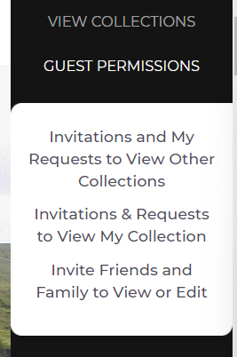
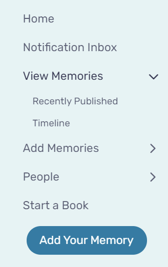

# Assignment 01: Heuristic Evaluation - Maleeha Zaman, DH110
## Tentative Title: Family Memory Archival 
>When my parents immigrated to America from Pakistan, they were only able to bring a few pictures with them. Whenever we did travel back to Pakistan to visit my grandparents, we found most of the photos had been lost during the moving process or misplaced. Years worth of nostalgic stories my parents told me about their younger days had been lost and it was sad they weren't able to share these memories with me. Although memories today have become digitized and encapsulated in our phone camera rolls, there is still a struggle to fully preserve those old photos our parents took on film all in one place. I plan to contribute through this UX project in order to preserve precious family memories to be shared across future generations and viewed at the user's convenience, strengthening the connection between users and their loved ones. 

### Jakob Nielson's [10 Usability Heuristics](https://www.nngroup.com/articles/ten-usability-heuristics/)

| Number | Heuristic | Description |
|---|---|---|
| 1 | Visibility of System Status | Users should always be informed about what is going on and should be given appropriate feedback to their actions |
| 2 | Match Between System and the Real World | Use concepts and language that are familiar and logical to the user |
| 3 | User Control and Freedom | Allow users to make mistakes; give them options to undo and redo tasks |
| 4 | Consistency and Standards | Follow conventions and make sure design is consistent across the platform |
| 5 | Error Prevention | Get rid of error-prone conditions and provide users with safety nets for high-cost errors |
| 6 | Recognition Rather Than Recall | Minimize user's memory load by giving them suggestions and help in context |
| 7 | Flexibility and Efficiency of Use | Provide multiple ways to perform a task to make the platform accessible to all users |
| 8 | Aesthetic and Minimalist Design | Provide only relevant content and features |
| 9 | Help Users Recognize, Diagnose, and Recover From Errors | Tell users what the problem is and provide suggestions to fix it |
| 10 | Help and Documentation | Supply users with extra help to complete their tasks |

### [Severity Ratings](https://www.nngroup.com/articles/how-to-rate-the-severity-of-usability-problems/) for Usability Problems by Nielsen Norman Group

The following rating scale can be used to evaluate the severity of usability issues:
| Rating | Description |
|---|---|
| 0 | I don't agree that this is a usability problem at all |
| 1 | Cosmetic problem only: need not be fixed unless extra time is available on project |
| 2 | Minor usability problem: fixing this should be given low priority |
| 3 | Major usability problem: important to fix, so should be given high priority |
| 4 | Usability catastrophe: imperative to fix this before product can be released |

Ratings are displayed for usability issues.

_*NOTE: red dots on images indicate location of cursor_

## Competitor A: Collectionaire

View the full site here: [Collectionaire](https://collectionaire.com/)
>Collectionaire is a website with a mission to document family history and archive immediate family's memories. To do this, users can make an account, go to "Create a new collection", and select a type of collection to make (Family Tree or Organization structure). From there, users can build a family tree or GEDCOM (genealogical data) file as a tree. The website has extensive information on what Connectionaire is, services that they provide, and video tutorials. 
#### Heuristic Evaluation
_Overall Evaluation_: The website is pretty well-tailored to older users, with lots of information in the tutorials and FAQ section to remind them how to navigate the tree and collection editors. However, there are many issues for the navigation of the site, sometimes requiring too many steps for one action and some misleading vocabulary used in the navigation bar. Furthermore, the main function of the site, which is to build a collaborative family tree, is pretty difficult to navigate in terms of sharing the tree and granting permissions. The text editors also have weak word processing power and no error prevention measures. The site could also improve  by including more languages aside from English to make the site more accessible to those who don't speak English, and options to increase text size.
 
 
### 1. Visibility of system status
The website clearly informs the user about its current status. 

>**GOOD**
>+ The site lets the user know the members being affected when they edit information on the tree by enlarging the icon of the family member.  
>+ The site clearly lets the user know if an invitation to view their collection has been sent by darkening the rest of the screen and showing a pop-up saying “Success!”.   
-----------------------------------------------------------------------------------------------------------------------------------------------------------------------
>**BAD**
>+ The site lets the user know when they are in tree editing mode by having a tab on the side appear that says “Tree Edit Mode”, however the site does not indicate when the user is in collection viewing mode. This is inconsistent and can confuse the user as to which mode of editing they are in.   _Severity Rating: 2_ _Recommendation: Add a tab when the user is in collection viewing mode that says “Collection Viewing Mode”._  

### 2. Match between system and the real world
The website uses language that is familiar to the user and presents information in a way that is analogous to the real world 

>**GOOD**
>+ The site utilizes a search bar for linked albums and a search bar for people when viewing collections. The placeholder of the text in the search bars are very specific and understandable. The album search bar says "Keyword, name, etc.;search all Linked Albums" and the people search bar says "Enter a few characters of a name". Having specific text placeholders within the search bar that prompt the user what to type into it is very helpful for the user's habits and denotes the relevant information they can search to find a person or album.  
-----------------------------------------------------------------------------------------------------------------------------------------------------------------------
>**BAD**
>+ The navigation menu uses terms that could be misguiding users to get to where they want to be, particularly "View Collections" and "Guest Permissions".   _Severity Rating: 1_ _Recommendation: Consider modifying navigation text to something more helpful towards users' existing habits. Perhaps changing "View Collections" to "My Collections" and "Guest Permissions" to "Share Collections"._        
                                                                                         
### 3. User control and freedom
The website gives users a way to easily undo an unwanted action 

>**GOOD**
>+ The site has a save or cancel option when editing any text, such as names, titles, or descriptions. This is helpful for the user who might not want to save the changes they made and allow them to keep the previous version of the text.  
-----------------------------------------------------------------------------------------------------------------------------------------------------------------------
>**BAD**
>+ The only way to undo an action while editing the collection is through the undo button, the user can't use "ctrl+z" keys. Furthermore, the user can't redo their work, they can only undo it.  _Severity Rating: 2_ _Recommendation: Add a forward arrow to the side bar that users can click on to redo their work. Add functionality for users to use "ctrl+z" keys for undo and "ctrl+y" keys for redo._   
                                                                                               
### 4. Consistency and standards
The website follows conventions followed by similar websites. 

>**GOOD**
>+ Clicking on "Collectionaire" on the top left corner of the page takes the user back to the homepage.
>+ The options of the navigation bar is listed at the top of the screen. These options collapse into a hamburger menu when the window width is narrow.    
-----------------------------------------------------------------------------------------------------------------------------------------------------------------------
>**BAD**
>+ The term "Exit" when hovering over the user's account is unconventional and difficult to understand.  _Severity Rating: 2_ _Recommendation: Change the term "Exit" to "log Out" which follows standard account conventions._   

### 5. Error prevention
The website prevents errors by reducing error-prone conditions or checking for them and notifying the user. 

>**GOOD**
>+ The site autosaves the collection when navigating to a new page, and it doesn't allow the user to navigate to a new page before deciding to save or cancel the work the user has done.  
-----------------------------------------------------------------------------------------------------------------------------------------------------------------------
>**BAD**
>+ The text input box for descriptions of albums, people, or events does not have spelling or grammar check options.  _Severity Rating: 3_ _Recommendation: Add spell check to the text input boxes to prevent grammar errors._   
                                                                              
### 6. Recognition rather than recall
The website makes information needed to navigate the website visible or easily accessible. 

>**BAD**
>+ The editing modes for a collection are inconsistent with each other. The tree editing mode has a button to navigate to the other mode that says “Exit Tree Editing Mode”, however the collection viewing mode has no button to navigate to tree editing mode. The user has to click on the three dots and “Edit Tree” to switch to tree editing mode.   _Severity Rating: 3_ _Recommendation: When the user is in tree editing mode, instead of having a button that says “Exit Tree Edit Mode”, have a button that says “Switch to Collection Viewing Mode”. Apply this vice versa for collection viewing mode with a button that says “Switch to Tree Edit Mode”._ 
>+ The "Guest Permissions" option on the navigation bar has sub-menu options within it that specify an action related to invites and requests. Some options sound too redundant and unneccesary which can be confusing for the user.  _Severity Rating: 3_ _Recommendation: Consolidate the sub-menu options to reduce cognitive load on users. Perhaps condense "Invite Friends and Family to View or Edit" and "Invitations & Requests to View My Collection" to one sub-menu option "Invitations & Requests to Access My Collections"._ 
                                           
### 7. Flexibility and efficiency of use
The website allows processes to be tailored to all users from novice to expert. 

>**GOOD**
>+ The collection editing page for each family member gives users different options to add descriptions of the family member, linked albums, and a timeline. Such editing features include adding photos or text.   
-----------------------------------------------------------------------------------------------------------------------------------------------------------------------
>**BAD**
>+ There is no option to audio record a memory or any speech to text option, which makes it less efficient to use for people who may not be as good with typing and who would like to speak about the memories being added to the collection. _Severity Rating: 2_ _Recommendation: Add a speech to text and audio recording feature._  
>+ Having two editing modes, tree editing mode and collection viewing mode, can be inefficient and frustrating for the user to constantly switch between the two to perform one action. _Severity Rating: 3_ _Recommendation: Consolidate editing modes into one single editing mode where the user is able to access both actions related to editing the tree or collections. This will make the editing process much quicker and more efficient for users._    
                                                                
### 8. Aesthetic and minimalist design
The website only contains information that is relevant and is designed to highlight the essentials   
 
>**GOOD**
>+ The user can expand and collapse albums when viewing collections.   
>+ The editing page for a family member is very minimalistic and easy to navigate for the user. The page utilizes plus icons and simple vocabulary so the user can instantly find what part of the member profile they want to edit.   
-----------------------------------------------------------------------------------------------------------------------------------------------------------------------
>**BAD**
>+ The user has to scroll through a long introduction page on the landing page to get to the footer menu, which has options that can't be accessed at the navigation bar on the top of the page. This wordy and long introduction page can be frustrating for the user to find the "Contact Us" or "Privacy and Security" pages. _Severity Rating: 3_ _Recommendation: Reduce the information on the introduction page to a simple blurb about the mission of the website and move any other information to the blog or FAQ page. This way it will make the landing page design less overwhelming and more minimalistic. The user would also be able to scroll down to the footer menu much faster._  

### 9. Help users recognize, diagnose, and recover from errors
The website provides clear error messages that state the problem and potential solutions 

>**GOOD**
>+ When the user enters an invalid email address on the login page, they are redirected to creating a free account with the invalid email already inputted onto the form already.   
-----------------------------------------------------------------------------------------------------------------------------------------------------------------------
>**BAD**
>+ When the user edits a family member, they can save the profile even without filling out the required fields marked with a red astrix.   _Severity Rating: 1_ _Recommendation: Prompt the user before saving as to whether they would like to leave these fields blank, so that the user is informed that key information is missing from the profile before they continue making their tree. Having something on their profile indicate this missing information on the tree-view would also help users easily identify which members are still missing key information._  

### 10. Help and documentation
The website has resources to help users understand how to complete tasks 

>**GOOD**
>+ The website includes "Navigation Rules and Tips" tab in the collections editor that gives the user a concise list of tips of the functionalities of buttons in the collection view.   
>+ The website has a "Help and Support" page that can be accessed through the navigation menu at the top. It has a lot of frequently asked questions, a link to view help videos, and a search bar to find a certain topic.   
-----------------------------------------------------------------------------------------------------------------------------------------------------------------------
>**BAD**
>+ The "Help Videos" page does not have a video or videos dedicated to sharing collections and requesting to view a collection, which is inefficient for users who might not understand the written explanation and need a visual to understand how to share.  _Severity Rating: 2_ _Recommendation: Add a video or videos to the "Help Videos" page dedicated to tutorials on sharing and requesting to view collections._  

## Competitor B: My Stories Matter

View the full site here: [My Stories Matter](https://www.mystoriesmatter.com/)
>My Stories Matter is an organization with a mission to help seniors to write creative stories. To do this, users can make an account, go to their "Creativity Center", and select a prompt to follow. From there, users can type their story in a text box or upload a photo of a written response. The website also has extensive information on what TimeSlips is, services that they provide, resources, news, and ways to get involved with the organization.
#### Heuristic Evaluation
_Overall Evaluation_: The website is very efficiently designed and pretty accessible to older users in terms of functionality and simplicity. For users familiar with social media formats of popular apps such as Instagram and Facebook would find it easy to navigate this site. However, the site could use lots of improvements in user error prevention, more detailed help documentation and navigation, and community interactions. It's primary role as a memory-keeping journal also fails in the fact that the text editors also have weak word processing power and no spell check system. While the site has options to increase text size, there could also be improvements such as including more languages aside from English to make the site more accessible to those who don't speak English.
 
 
### 1. Visibility of system status
The website clearly informs the user about its current status. 

>**GOOD**
>+ The homepage of the user's profile shows a progress bar of how to get started on the website. This provides a good visual representation of  progress and guidance towards a user who may be unsure how to start uploading and sharing memories.   
>+ Before publishing a memory, the site notifies the user when they haven't filled out the month and year of the memory and prevents them from publishing. Highlighting the letters in birght red and with red astrixes help the user easily scroll through to find what they are missing.    
-----------------------------------------------------------------------------------------------------------------------------------------------------------------------
>**BAD**
>+ When the user clicks on publish, the site does not prompt the user as to whether they are sure they want to publish the memory. This can be inconvenient for users who originally intended to save the memory as a draft and could have accidentally pressed the publish button instead. _Severity Rating: 2_ _Recommendation: Add a pop-up after the user presses publish that asks "Are you sure you want to publish this memory?", prompting the user to answer yes or no to ensure the user actually intends to publish it._  

### 2. Match between system and the real world
The website uses language that is familiar to the user and presents information in a way that is analogous to the real world 

>**GOOD**
>+ The site has a navigation bar on the left side uses easy-to-understand terms like "Home", "Notification Inbox", "View Memories", "Add Memories", "People", and "Start a Book".   
-----------------------------------------------------------------------------------------------------------------------------------------------------------------------
>**BAD**
>+ The submenu for "People" to make collaborative groups is called "Friend Circles". This name may not be intuitive for all users who might not understand what a "Circle" is.    _Severity Rating: 1_ _Recommendation: Consider changing "Friend Circles" to "Groups"._        
                                                                                         
### 3. User control and freedom
The website gives users a way to easily undo an unwanted action 

>**GOOD**
>+ After publishing a memory, the user can click on the drop-down menu that says "Action" and has the option to edit the memory, add it to a collection, delete the published memory, or move it into drafts.  
-----------------------------------------------------------------------------------------------------------------------------------------------------------------------
>**BAD** 
>+ The site's messaging feature doesn't allow the user to delete or edit their message after sending it. They only have the option to archive the conversation.  _Severity Rating: 3_ _Recommendation: Add a delete message feature that deletes the message for both the user and the message recepient. Also add an edit message feature_   
                                                                                               
### 4. Consistency and standards
The website follows conventions followed by similar websites. 

>**GOOD**
>+ The landing page on the site, for new users or users who haven't logged in yet, has a sign up or log in option being the first thing users see. This is a standard convention for websites, particularly social media, to notify users must have an account before they can interact on the site.  
>+ The options of the navigation bar is listed at the side of the screen. These options collapse into a hamburger menu on the top of the screen when the window width is narrow.    
-----------------------------------------------------------------------------------------------------------------------------------------------------------------------
>**BAD**
>+ The messaging feature doesn't have a group chat functionality which is usually the standard convention for any messaging applications or websites. _Severity Rating: 2_ _Recommendation: Add a messaging feature such that the user can form group chats._   

### 5. Error prevention
The website prevents errors by reducing error-prone conditions or checking for them and notifying the user. 

>**GOOD**
>+ On the "Add a Memory" page, if the user tries to navigate away from the page, they are prompted with a pop-up as to whether they are sure they want to go back without saving.  
-----------------------------------------------------------------------------------------------------------------------------------------------------------------------
>**BAD**
>+ The text input box when creating a memory does not have spelling or grammar check options.   _Severity Rating: 3_ _Recommendation: Add spell check to the text input boxes to prevent grammar errors._  
                                                                              
### 6. Recognition rather than recall
The website makes information needed to navigate the website visible or easily accessible. 

>**GOOD**
>+ The memory editing page has multiple options at the end of the page when the user is done editing, giving them a clear route to navigate to where they want to be after they're done editing. These options include "Save & Go Back to Drafts", "Publish", and "Save". These clear descriptions informs the user that they can also go to their drafts from the editing page.    
-----------------------------------------------------------------------------------------------------------------------------------------------------------------------
>**BAD**
>+ The "Collaboration Invites" is a bit misleading. The page allows you to view memories that other users have given you collaboration permissions for, but it also gives prompts to create memories meant for collaboration which can be confusing. Some users could mistake these as a way to add collaborators to memories they've already created and it is not really clear as to what these prompts are for until the user clicks through them.    _Severity Rating: 3_ _Recommendation: Move the prompts to the "Add Memory" page as a drop-down menu for the memory subject. Instead of including prompts under the collaborator invites, include the user's posts with the option to "Add More Collaborators" which would add more functionality to the page and reduce the cognitive load placed on users._ 
>+ There is an obscure feature the site does not mention at all called "MindPops". The icon is a lightbulb icon was misleading and could translate to adjusting the brightness, or as a method to switch to a possible dark mode. The user would have to click through every button to learn about this feature.   _Severity Rating: 3_ _Recommendation: Alter the way in which the user can access MindPops. Perhaps add a floating button located on the top right of the page, maybe shaped like a thought bubble, that clearly says "MindPops" in bold font so this feature is more noticeable to the user._  
                                           
### 7. Flexibility and efficiency of use
The website allows processes to be tailored to all users from novice to expert. 

>**GOOD**
>+ The memory editing page has an option to have a chat just for collaborators on the side so that users can discuss with their collaborators while editing the memory.   
-----------------------------------------------------------------------------------------------------------------------------------------------------------------------
>**BAD**
>+ The user can't audio record and doesn't have a speech to text option. This makes the editing process less accessible and efficient to those who would rather talk than type about their experiences. _Severity Rating: 3_ _Recommendation: Add a speech to text feature and audio recording feature._  
>+ When the user clicks on an image someone posted from the feed view of the people they follow, the page redirects the user to an expanded full-page view of the post where they have to click the image again to view its details. View from Feed:   After clicking on image (Expanded Full Page View):   Image Details:   _Severity Rating: 3_ _Recommendation: Fix this functionality such that when the user clicks on the image in the feed view, they instantly see the image details rather than having to go through the expanded full-page view to see image details._    
                                                                
### 8. Aesthetic and minimalist design
The website only contains information that is relevant and is designed to highlight the essentials   
 
>**GOOD**
>+ The dropdown menus for each option on the navigation bar will automatically collapse themselves when the user clicks to expand another dropdown menu. This ensures there is less clutter and words to sift through for the user, and simplifies their view without forcing the user to collapse the menus themselves.   
>+ The editing page for memories is easy to navigate for the user, where they can easily see where to add text, photos, date, headers and subheaders.    
-----------------------------------------------------------------------------------------------------------------------------------------------------------------------
>**BAD**
>+ The homepage is kind of unconventional for what is essentially a website dedicated to sharing and viewing memories and journal entries. The page is dominated by journal prompts and challenges, which is not bad to include, however, users would most likely like to see their memories first. This makes the design for the homepage irrelevant to the goal of the website. Furthermore, the challenges are quite wordy and overwhelming, which is also not a good thing to show users when they first open up the site.   _Severity Rating: 3_ _Recommendation: Condense the prompts and challenges to the top of the page and format the homepage into a feed where users can scroll down and view recent memories. This follows the intent of the app more rather than making the homepage packed with journal prompts and challenges._  

### 9. Help users recognize, diagnose, and recover from errors
The website provides clear error messages that state the problem and potential solutions 

>**GOOD**
>+ When the user adds images to the memory, they are notified that any images they add won't be saved into the memory unless they hit the save button at the bottom.   
-----------------------------------------------------------------------------------------------------------------------------------------------------------------------
>**BAD**
>+ New users has the option to see community memories set to off as a default when they first create their account. Most users would not be able to detect this issue and would assume the site only allows them to see their own memories in their feed. The user is forced to go to their settings to turn viewing community memories on.    _Severity Rating: 3_ _Recommendation: Have the default settings set such that the user does view community memories when they first make their account. Notify the user through a pop-up that they can turn viewing community memories off by navigating to their settings._  

### 10. Help and documentation
The website has resources to help users understand how to complete tasks 

>**GOOD**
>+ The memory editing page has a "Tips & Samples" dropdown that gives the users a list of suggestions and examples they can use as a reference for creating their own memories.   
-----------------------------------------------------------------------------------------------------------------------------------------------------------------------
>**BAD**
>+ The "FAQs" page is kind of obscured from the main page by being located in the footer of the website. Furthermore, the "FAQs" page itself is very long and wordy, making it visually cluttered and difficult to navigate.     _Severity Rating: 3_ _Recommendation: Add "FAQs" to the navigation bar on the side, as well as include a navigation to "FAQs" after the user clicks on the question mark in the top right corner. Implement a search feature on the "FAQs" page so users can quickly find an answer to the topic they are concerned about._  
