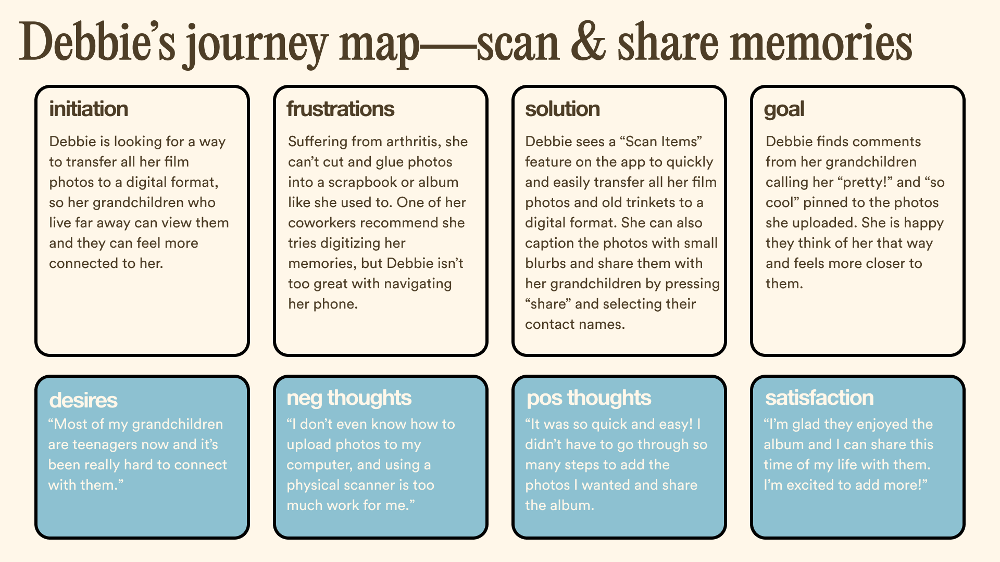

# DH110 Assignment 4: Personas & Scenarios
# Maleeha Zaman
## Purpose of UX Storytelling
UX storytelling helps researchers stay in touch with their users and is a great practice of user-centered design. It helps filter out any biases by reflecting on the user's background, feelings, and motivations. Creating different personas and scenarios, I was able to gain a more thorough understanding of my target users by viewing them from various perspectives and empathizing with their frustrations and desires. 

## Personas & Empathy Maps
### Samra Khan—loving mother
#### Samra's Persona

#### Samra's Empathy Map

### Debbie White—aspiring family archivist
#### Debbie's Persona

#### Debbie's Empathy Map

## Scenarios & Journey Maps

### 1. Samra
#### Why Samra is using this product
> Samra works as a nurse at UCLA Health and lives in Santa Clarita with her husband and her daughter, Mina. Mina is 5 years old and recently just started preschool. Samra can't believe that 5 years had already passed since her daughter was first born, and feels like time is flying by. As a young mother, Samra loves to take lots of pictures of her daughter at any occasion, always spamming the camera at any moment's notice. Her parents are always asking for updates but she has trouble finding the right pictures to send them because there are so many. Samra wants a place where she can easily search through and sort photos and videos of her daughter, something simple where she doesn't have to worry about storage space.
#### How Samra is using this product
> Since it was recently her daughter's first time dressing up for Halloween at school, Samra decides to consolidate all her daughter's firsts and wants to make an album. Samra makes a profile for her daughter and creates a new album called "My Lovely Mina". She selects the photos she wants to use from her phone by clicking the "Add Photos" button and organizes them into different stories such as "Mina's First Day of School", "Mina's Halloween", and "Mina's Birthdays". Samra doesn't have to include timestamps, since the app reads in the timestamp from the camera roll and automatically inputs one for the user, although Samra may choose to edit those timestamps if she chooses. Samra can also add little blurbs alongside her photos, such as "When Mina made her first friend at school". After sorting through the photos, she can search for specific ones by typing a keyword, such as "First Day" or "friend" to find photos related to Mina's first day at school. She can also filter the search using timestamps, recently added, and by most viewed. 
#### Samra's Journey Map

### 2. Debbie
#### Why Debbie is using this product
> Debbie has felt more distant from her grandchildren, now that they are no longer young and are entering their teens. Debbie's kids all live in distant places and only come to visit during the holidays. She yearns to feel more connected to her grandchildren, and stumbles upon her boxes of old photos taken on film and trinkets from while she was young. Reminiscing upon the days she caused mischief and had all kinds of fun, Debbie had an idea to share these memories with her grandchildren. Initially, Debbie tries to find out how to scan pictures on her phone, but she struggles immensely and gets frustrated. She consults one of her coworkers who is far more tech savvy than her, and they reccomend she uses an app that helps her quickly and efficiently scan and upload these photos to a digital platform she can easily share with her grandkids. Debbie is also ecstatic to hear she can also write captions for each photo so that she can describe the stories behind them.
#### How Debbie is using this product
> Debbie creates a profile for herself using her email and full name. Then she goes to create a new album, where she sees a big button that reads "Scan Items" and bold letters. Debbie then scans some photos and old train tickets using the phone camera one by one, and is able to sort them as she scans, and continue scanning until she can hit the "Stop Scanning" button that takes her back to the album page. In addition to scanning, Debbie wants to take pictures of the pocket watch her late father gave her and hairpins from her mother. To do this, she clicks on "Add Family Treasures", where she can take or upload a pictures/videos of these items and write descriptions for them. The album automatically saves periodically, and has an indication in the corner that says it has been saved, so Debbie doesn't need to worry about losing her photos or progress. At the top right of the album icon, there is a button that says "Share" that Debbie can click on which navigates her to her messages where she can add the contacts she wants to share the album with and press send. The message that shares the album says "Take a look at this album and leave a comment!" followed by a hyperlink.
#### Debbie's Journey Map

## Reflection
* Creating personas takes a lot of work because of how multidimensional yet variant users can be. It was definitely a rewarding experience as it helped me better understand how a user may initially interact with the app and the emotions behind it. 
* Some limitations I encountered was not doing more research on non-traditional family structures. I encountered this during my contextual inquiry but felt I was not equipped enough to create a persona on this, and could've misrepresented that group of target users. Next time, I hope to go more in-depth and create a persona of someone with a non-traditional family structure. I also wish I researched more demographic information. 
* I feel I was able to gain a more clear representation of the types of functionalities I should and should not include in this family archival/collector's app. I want to emphasize simplicity and efficiency by resolving any key aspects of frustration when it comes to the process of uploading, scanning, and sharing media with other family members. 
* Additionally, I should look into more filters that would help a user organize their memories a lot easier, as well as an easily navigable profile system that allows users to sort their albums by people and even add collaborators to add their share of photos. I do want to stray away from this app being a social media app, and more of an archival or collector's app where the user can limit people who view these albums and maintain privacy. 
