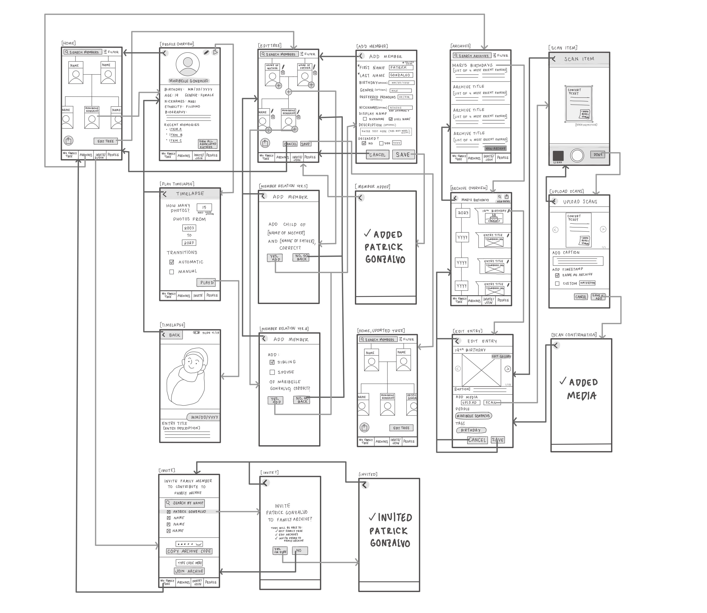
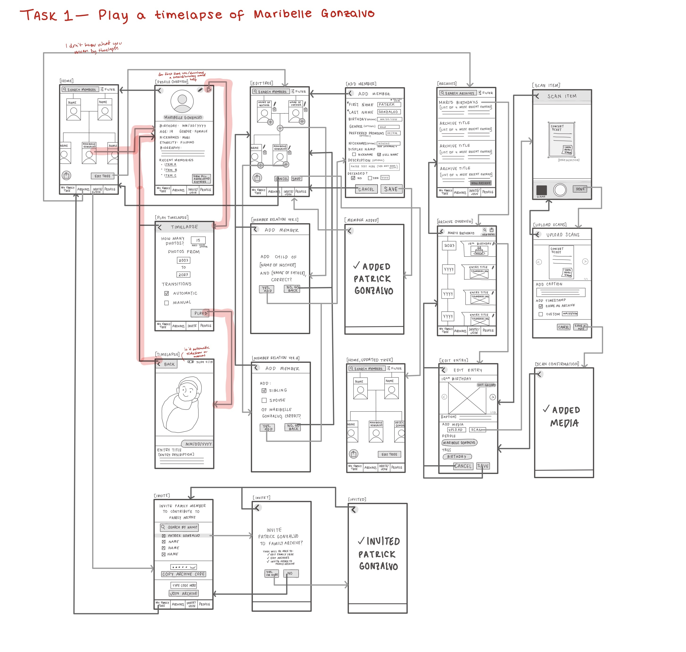
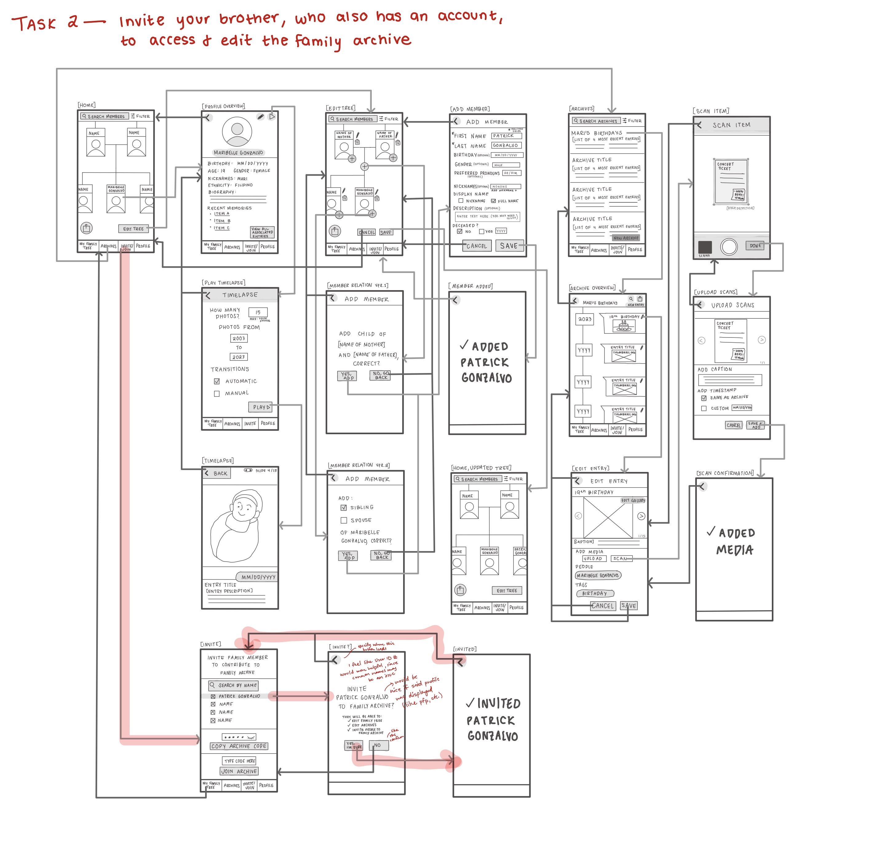
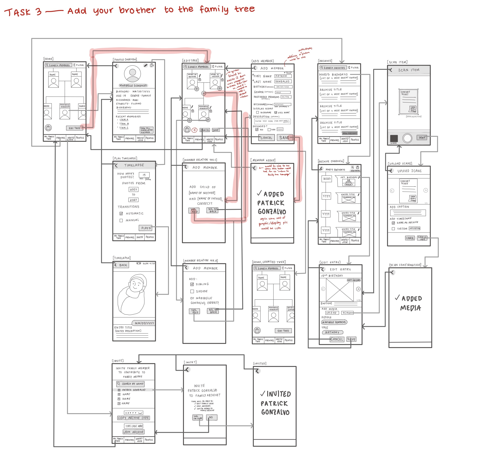
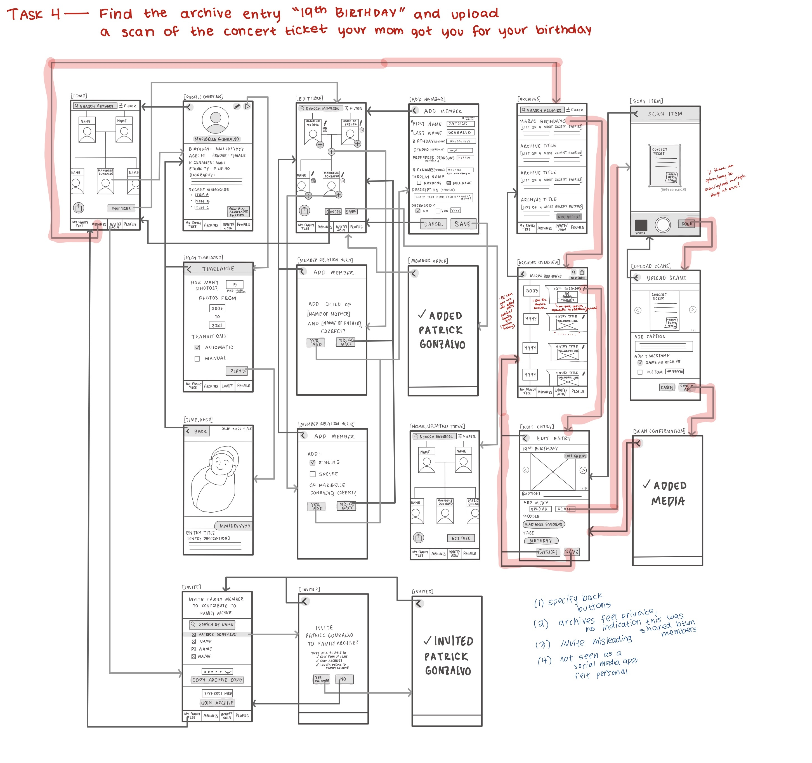

# DH110 Assignment 5: Low-fidelity Prototype
# Maleeha Zaman

I want to create an app that allows people to create an archive of their family history and lineage, and work collaboratively on this archive with other family members, based on the family archival website Collectionaire. My ultimate goal is to help users bond more with their family members through a simple and creative way to organize and view their memories. The app will allow users to:
1. Explore and record their family lineage with a family tree
2. Build and add on to the family archive with entries by uploading or scanning media directly, and writing journal entries
4. View a timelapse of each family member through their profile
5. Invite other family members to be able to view and edit the archive
To evaluate the logic and flow of the screens of the app, I created low-fidelity prototypes to test these features to identify any problems early on and continue to revise my design.

## Research that Informed Design of the Low-Fi Prototype
  *  Based on my heuristic evaluation of the Collectionaire website, I found that the site had issues in providing helpful information to aid navigation (recognition rather than recall) and waws rather complex, particularly of their editing collections and trees features that was difficult and confusing to navigate without a tutorial. The site also didn't have too much flexibility, in which the user could only be a part of a single archive and there were no options to include audio recordings within the collections. 
  *  During my usability testing, I found that the additional issues of lack of visibility of system status concerning the family tree. My participant struggled to find a family member because the tree condensed without notifying them, and they had no clue how to uncondense the tree. I also found the website tended to provide too much information in regards to sharing an archive with another profile, such that my participant got confused over the sharing permissions and had to read them over again to understand what they meant. Particularly, my participant noted it was a lot of jargon for what is supposed to be a simple sharing function. 
  *  In my user research and contextual interview, I realized a family archive is more than a cloud-based photo storage space for family photos, but a creative outlet for family storytelling. I found the motivation to record family memories is to preserve the core parts and warmth felt during those times, supplemented with physical keepsakes such as receipts or candy wrappers that the memory more personable for the user. I realized giving the user the creative freedom to view and craft entries in the archive gives them the oppurtunity to express and have agency over their own family story. My participant also tended to view their closest loved ones based on certain snippets of their lives, which gave me the idea to incorporate a timelapse feature for each family member.
* Personas (see [here](https://github.com/maleehaz/DH110-Spring2023/blob/main/Assignments/A04/Assignment04.md))
  From the above findings, I created two personas:
  * Samra, a full-time nurse and mother who wants to log every memory she has with her daughter
  * Debbie, an aspiring family archivist who has boxes of old photos and wants to share them with her distant grandchildren
## Wireflow

## Testing the Prototype
### Task 1: Play a timelapse of a member of the family tree
Completed✔️
* The participant was initially confused as to what was meant by "timelapse", had to give clarification that it was a video/slideshow of a family member's photos between a certain range of years. 
* Although they completed the task relatively smoothly after asking for clarification, the participant said they wouldn't have known to press the play button to start a timelapse if the wireflow arrow wasn't there. They suggested for first-time use, some sort of overlay tutorial would help them understand what each button meant or if the button clearly said "Timelapse" rather than the play button. 
* The task was completed relatively smoothly, but the participant noted it was unclear whether the transitions for the timelapse were manual or automatic because of the slideshow buttons. Although the wireflow shows that the user selected automatic, this was not reflected on the timelapse screen. 

### Task 2: Invite a family member, who also has an account, to access and edit the family archive
Completed✔️
* The participant completed the task pretty quickly with no issues.
* They suggested to incorporate user IDs/usernames since multiple people could have the same first and last names for their profile. They further added more aesthetic suggestions to display the profile pictures of the user they plan to invite and noted that it would be nice.
* The participant said the term "Invite/Join" was misleading for the page title, and didn't know it was to invite members to the archive until they opened the page. They suggest changing the name to something more informative and clear.  

### Task 3: Add a member to the family tree
Completed✔️
* Task took slightly more time than the other two, but was completed smoothly with little to no issues.
* The participant took a while to choose which plus sign to select. They ended up choosing to add the family member through the plus sign that was on the tree branch rather than the plus signs placed on the corner of each profile.
* They suggested that it would be much easier and quicker for them if the page only had one plus sign, and they could choose from a list of different relations, especially if they planned on adding some sort of distant relative. 
* They noted that being able to add the profile picture on the "Add Member" page would be nice as well. 
* The participant took notice of the back buttons, and said the arrow was a bit too vague sometimes, and would prefer a more clear navigation indicator such as "Return to family homepage". 

### Task 4: Find an archive entry and upload a scan to the entry
Completed✔️
* Navigation went smoothly overall
* The participant enjoyed the timeline format and liked the idea of being able to scroll through an archive and experience it in a chronological order. 
* They suggested to make the entry "expandable", such as adding three dots so the user can view the journal entry associated with the entry. 
* The participant asked if all profiles who have viewing and editing permissions for the tree can see all the archives, to which I replied yes. They further suggested that it would be helpful to add a version/edit history of the entries so if a family member mistakenly edits one of the archives, the user can restore a previous version. 
* For the scan feature, they questioned whether there was an option to scan multiple things at once. 
* The participant hoped for a similar to edit functionality to the family tree where the user had to click "Edit Tree" to navigate to a page where they can make edits. The participant didn't like seeing the pencils next to each entry immediately. They worried that a family member might accidentally edit the entry when they were just trying to view it. 

## Reflection
Since I personally designed the wireframes, I couldn't gauge how easy to navigate the low-fidelity prototype would be for other users since I already know the flows by heart myself. After watching my participant test my prototype, it made me realize I put more work into designing a particular feature but not enough work into designing a more recognizable and easy to navigate interface. I realized some types of vocabulary I used within my information architecture tended to be a bit more confusing and that area could use a lot more revision to be much simpler and comprehendable to new users. This experience felt very valuable because I also gained a better understanding of the user's logical flow when it came to the prototypes and watch them actively experience my app in its earliest stages. 

In future wireflows, I hope to incorporate more screens and more complex interactions for each screen (adding multiple arrows for a screen rather than a single arrow, which I felt contributed to my participant's ease of navigation). Especially after this testing session with this low-fidelity prototype, I wish I added more navigation and search tasks, having my participant actually utilize the search archives and filter functions on the archives page. I also would improve my information architecture a lot more and incorporate more user-friendly/easily comprehendable terms.

Based on the participant's perception of the timelapse feature, it seems that most users would not actually find this feature and that it feels hidden within the design. Adding some sort of additional help documentation, or maybe making the timelapse feature more visible could be helpful for users to encounter it. The edit tree function seemed to be a bit overwhelming for the participant, especially with the number of plus buttons on the screen. It appears there was quite a bit of cognitive load required to choose which plus button to choose for the participant. To reduce this cognitive load, creating a single plus button with a dropdown of relations, and  a place to select the user the new member being added is related to, would make the edit tree more simple to navigate for users. For the invite feature, my participant was able to navigate the feature pretty smoothly, I would only change the pagename "Invite/Join" to something more clear such as "Add Collaborators". I liked my participant's suggestion to add an expand feature to the archive entries and think this would enhance the archive's storytelling purposes. I should also add more clear back navigation indicators, such as "Return to ..." rather than just using a back arrow. I will also add an extra button in each archive that says "Edit Entries", so the user is less inclined to accidentally edit an entry when they try to view one.  
