# DH110 Assignment 6: Interface Design System
# Maleeha Zaman

## Description of Project
My goal for this project is to design a mobile platform where people of all backgrounds and ages can craft and experience their own family archive in a creative and simple way, collaborate with other family members, explore their family lineage, and have unlimited space to store important media (photos, audio recordings, documents, videos, journal entries). I decided to name the platform "Memoire", which is french for memory. It is also a play on the word "memoir" which means a historical account written from personal knowledge in the english language. It reflects the nostalgia users feel when they look back on their family memories and emphasizes the user's ability to tell a story about their own family. 

## Purpose of Interface Design
The purpose of interface design is to convert my low-fidelity wireframes into a digital form with a more developed design on Figma. Good interface design is simple, not overwhelming for the user, and separates information into readable blocks using principles of design, such as gestalt theory and color contrast accessibility. A well-designed app will make it more intuitive for users to navigate and find the information they need. The screen I decided to design was the home page, which shows the family tree which serves as a basis for the app where the user can view all their family members at once. 

## Screen Design Process

### Initial Low-Fidelity Wireframe
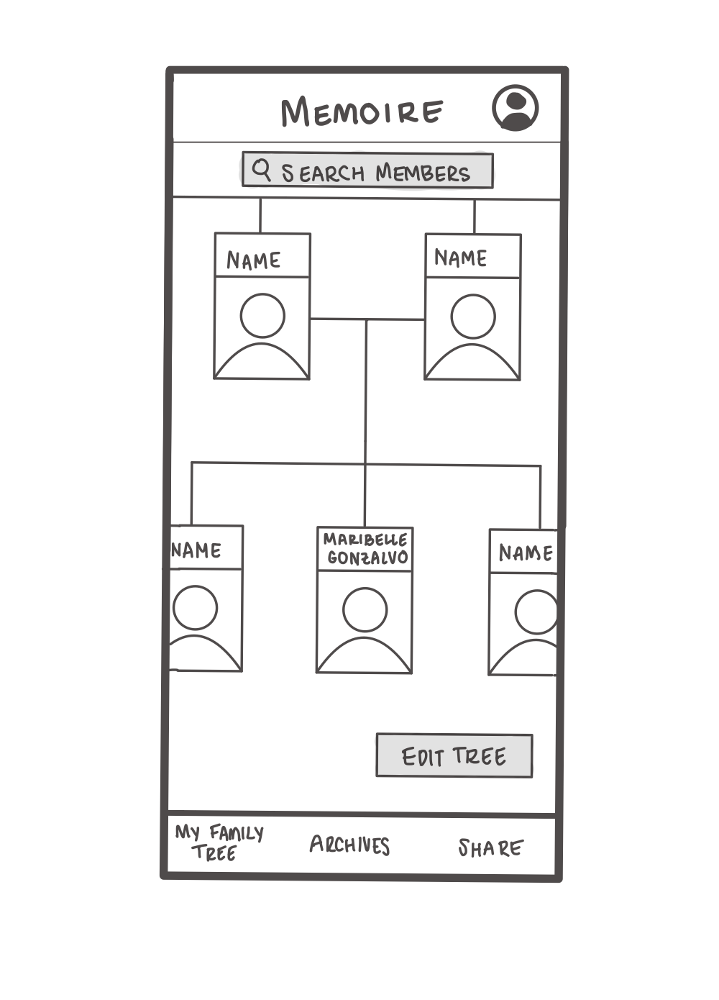

### Design and GUI Component Layout
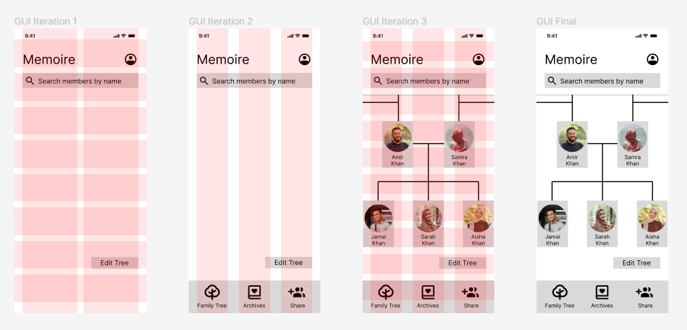
For the layout of my design, I used three different grids to align different items on the Family Tree page:
1. Top Navigation and Edit Button
*  2 column grid with 24px margin, 18px gutter
*  8 row grid with 32px margin, 18px gutter
2. Bottom Navigation Bar
*  3 column grid with 24px margin, 32px gutter
4. Family Tree
*  3 column grid with 24px margin, 32px gutter
*  10 row grid with 38px margin, 20px gutter

### Typographic Variations
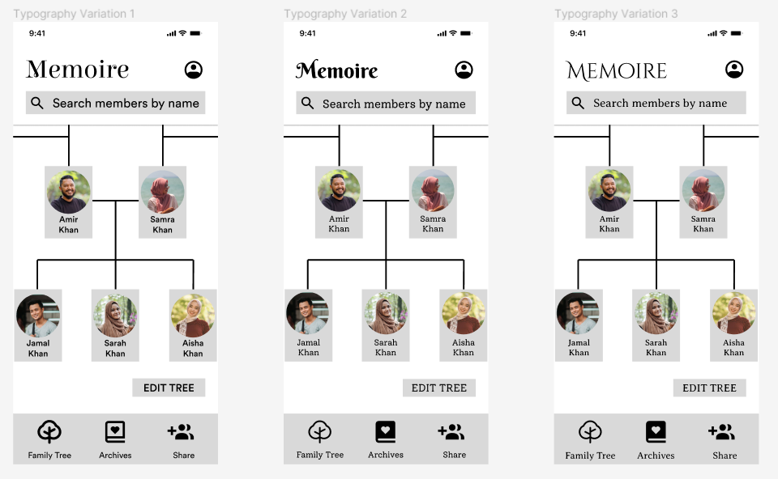
For typography, I wanted the app to feel refined and vintage. I tried various fonts for the body text. First, I tried using Circular STD font because it is simple, ledgible, and readable. Second, I tested the Solway font, which felt like it gave the app a scrapbook-like and more fun appearance. Third, I tried the Averia Serif Libre, which I felt gave the app more of a formal feel to it, less like a classic social media or messaging app and more like a personal journal. After testing these fonts, I found myself stuck between the Averia Serif Libre and the Circular STD fonts. The Averia Serif Libre felt more stylistic and more unique to the app, but it lacks in readability because it is a serif (has embellishments) font. The Circular STD font is minimalistic and readable, but I felt it took away the personable and journal-like feel that the Averia Serif Libre font has. I experimented with Berkshire Swash, Elsie Swash, and Cinzel Decorative fonts because they are stylized and simple enough to be readable. I ended with going with the Cinzel Decorative font because it felt the most refined and suited to the app layout. I ended up choosing Averia Serif Libre for body text.  

| Text | Typeface | Font Size | Weight |
| ------------- | ------------- | ------------- | ------------- |
| Main Title (eg. Memoire title) | Cinzel Decorative | 40px | Regular |
| Heading 2 (eg. Search Bar, Edit Tree Button) | Averia Serif Libre | 20px | Light |
| Body (eg. Family Member Names, Navigation Bar) | Averia Serif Libre | 16px | Regular |

### Button Variations
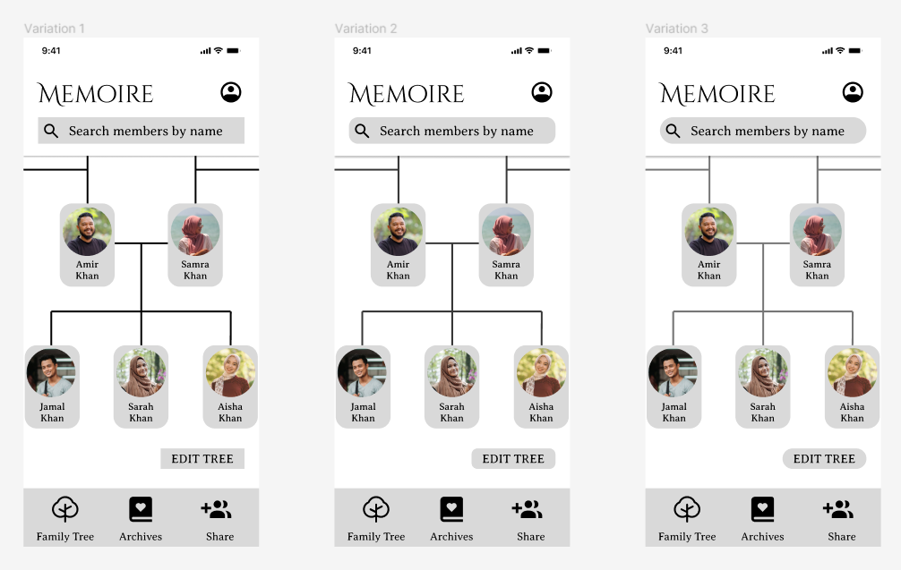
I tested three button variations (for the **search bar** and **edit tree** button) with different rounded corners: rectangle (0px), rectangle with slightly rounded corners(15px), and rectangle with fully rounded corners(40px). Both the rectangle and rectangle with slightly rounded corners made the design to blocky and geometric, making the app feel too static. I felt the rectangle with fully rounded corners felt the most inviting to so I decided to go with this option. I also decided to make the **profile cards** rectangles with slightly rounded corners to separate them from the search bar and edit tree button. The rounded corner radius I used for the search bar and edit tree button was 40px, and the rounded corner radius for the profile cards was 20px. 

### Icon Variations
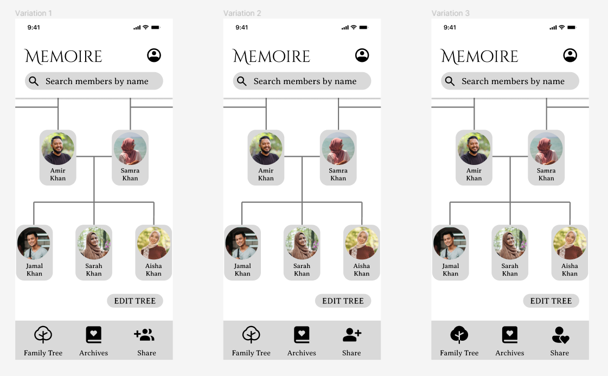
I tested variations of the **tree** and **share** icons. If I had more time on this project, I would've designed them myself, but I ended up using the Iconify plugin on Figma for these variations. The first two variations have a person with plus sign by them, which I felt communicated the idea of adding someone to contribute to the archive. However, I ended up going with the person with the heart because I felt it made the app more warm and welcoming, as if adding someone to contribute to the archive was like "sharing the love" between family members, emphasizing connectedness over a more emotionless digital form of sharing that is conveyed through the plus sign. I also ened up changing the tree to its black filled variation because I felt it matched the other icons, which were also filled, a lot better.

### Additional Detailing
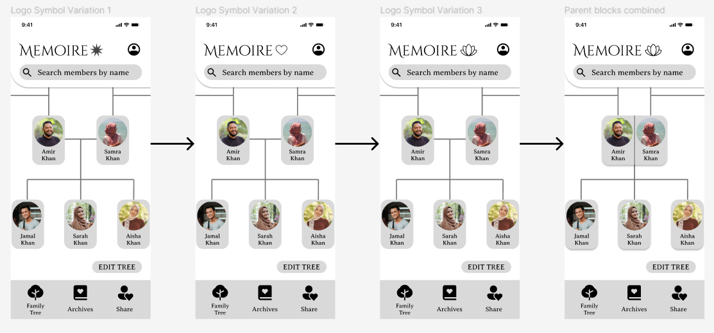
I added a single rounded corner to the **top navigation bar** with a radius of 50px, I felt this added more movement and less blockiness to the app design. I also thought it made it look like a bookmark inside of a journal, making the app look more personable and inviting. I did variations with the **Memoire logo icon** using a star, heart, and lotus. The star made the app look more related to astrology and I felt the heart made it look less refined. I ended up going with the lotus because it was simple, but it also fanned out like a growing tree and complimented the family tree feature pretty well. Lotuses are also known to be symbols of enlightenment and rebirth. Finally, I ended up conjoining the parent cards because I felt it emphasized their marriage a lot more.

### Color Variations
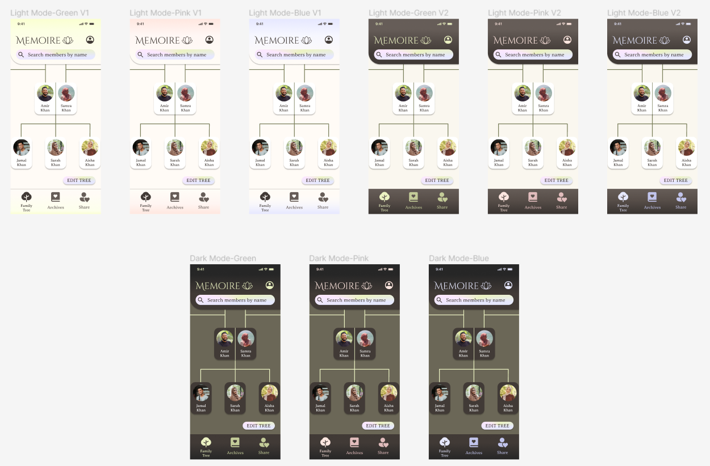
I created a light and dark mode of my design, with some changes in the color palette depending on its usage on light/dark mode. I created two major variations of light mode, one with a primarily beige color scheme and the other with a mix of beige contrasted against a light brown color scheme. Each major variation has three smaller variations that consist of blue, pink, or green. The dark mode has three variations as well with blue, pink, or green. For the impression test, I decided to go with the primarily beige variation because it felt the most like a light mode to me. I ended up choosing pink for both the light and dark modes. 

## Impression Testing
I conducted an impression test (see [recording](https://drive.google.com/file/d/1TelFFi6r_YU-4mCxXWEY4DcXNqyBNNou/view?usp=sharing) and [transcript](https://drive.google.com/file/d/1TX0g7G5eSbzRDh0sMSxa4UWZ6CJXzsDf/view?usp=sharing)) over zoom.

I did a 5-second test first. I showed the design for 5 seconds then asked for her first impressions and what she could remember. 
### 5-second-test findings
* Noticed family tree and thought app was to mainly keep track of family lineage
* Intuitively thought tapping on the profile picture would expand into some sort of biography
* Noted the background was muted and felt nature-esque
* The app felt "calm" and "connected" to them

Then, I sent her the prototype link and asked her to look at the screen and give me feedback on the design. I asked for specific feedback on typography, color palette, and layout. 
### Color Palette
* Prefers dark mode
* The contrast on the light mode wasn't clear enough
* Light mode looked dull
* The tree connector lines in the light mode didn't feel too visible, felt more like an "industrial hierarchy"
* Liked the colorful gradient near the top for both light and dark modes
* Emphasized how they liked the color palette and contrast on the dark mode a lot
* Dark colors feel more "archival" to them
### Typography
* The words were ledgible, but not readable
* Didn't like the font
* Felt the profile names were difficult to read because it was a serif ("curly") font
* Thought the font too thick and close together
### Layout
* Very straightforward and organized
* Minimalistic
* Felt the button names and icons were intuitive and they could understand what each icon was for
* The tree format was evidently a family tree to them, could discern who were the children and who were the parents
* Prefers dark mode because lines and boundaries felt more clear
### Additional Feedback
* Emphasized changing the font to something less "curly" 
* Suggested to thicken the tree connector lines so they were more visible and clear
* Noted that having parent cards be conjoined together could not be scalable to people with more complex families (eg. parents who have been in more than one marriage or had kids with other partners) 
  * Suggested instead of having them conjoined, have them linked by another line (*My response to this critique is to keep married members conjoined, and those who had kids but are no longer married connected by a line*)
  
## Post-Impression Test Edits
I changed the font from Averia Serif Libre to Circular STD because I felt it was more important that the app was ledgible and readable over stylistic. I decided to go with the other light mode variations (mix of beige and light brown) in response to my participant saying darker colors made the app feel more archival, and I added more contrast to the variation by darkening the beige in the background more. I also thickened the tree lines to make them more visible and clear. 

## Accessibility & Contrast Check
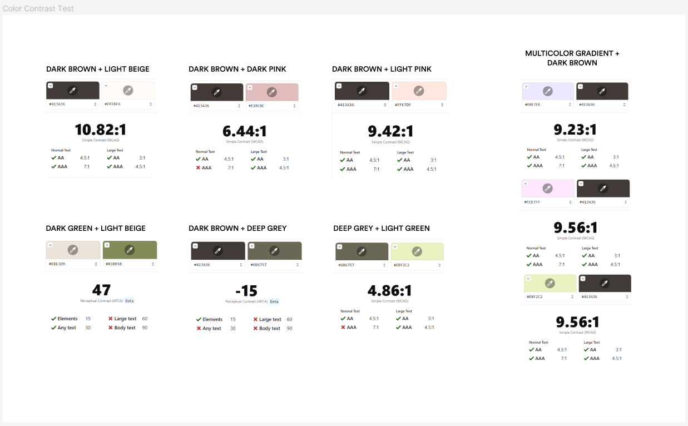

## Final Screen & Design System
### Screen Design
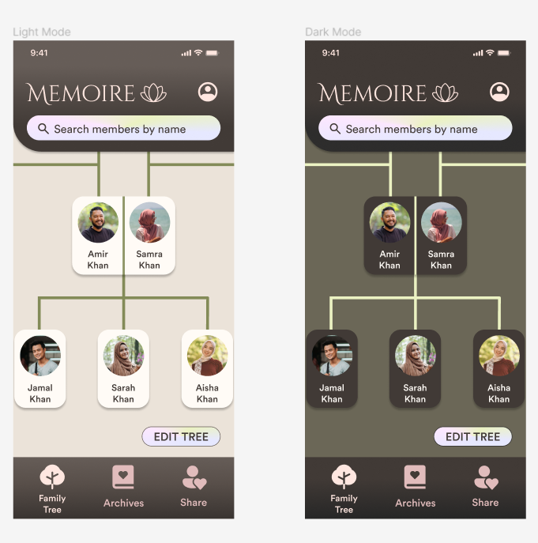
### Color Palettes
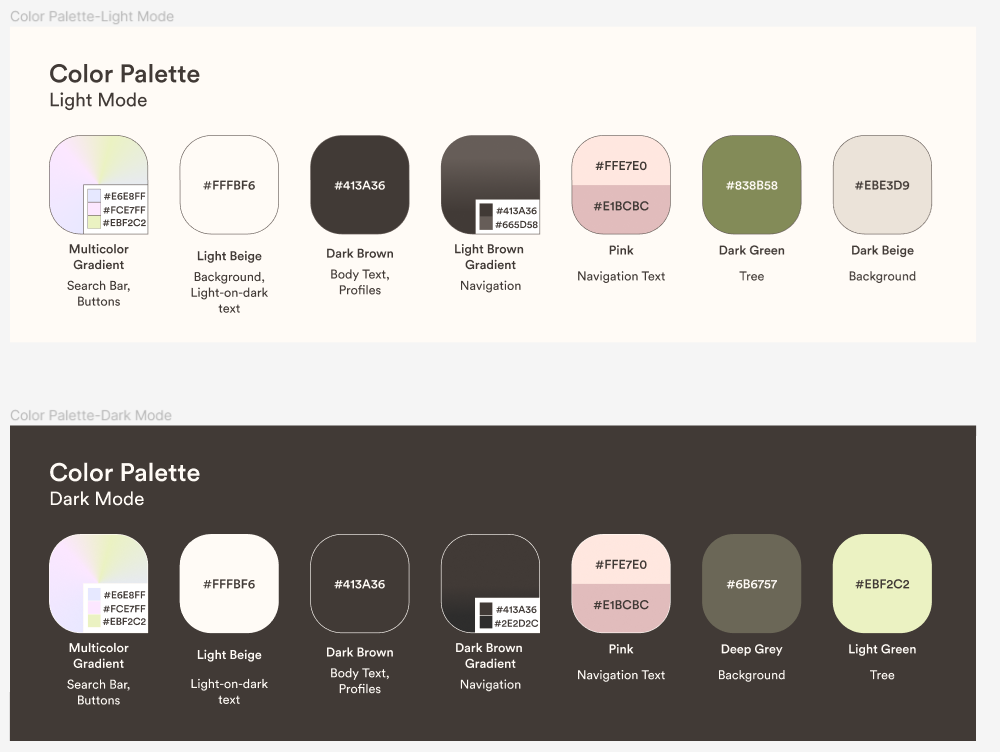
### Typography
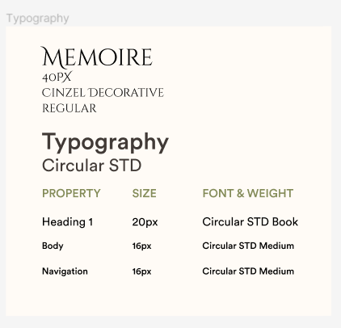
### Layout & Spacing
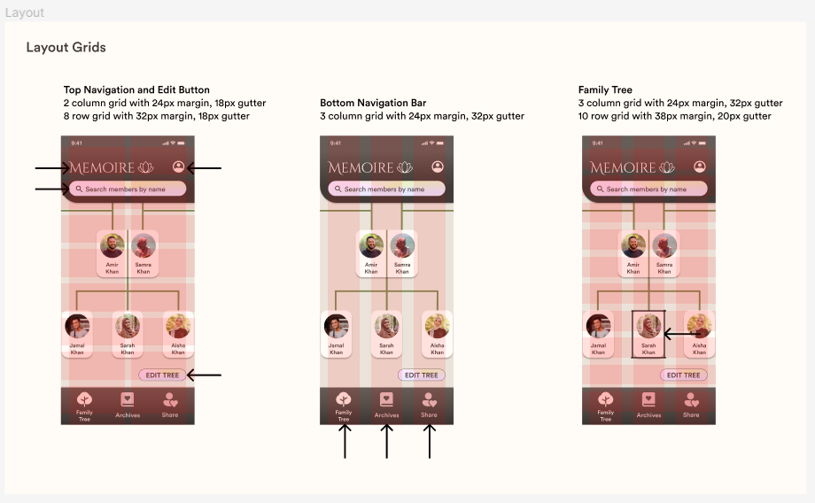
