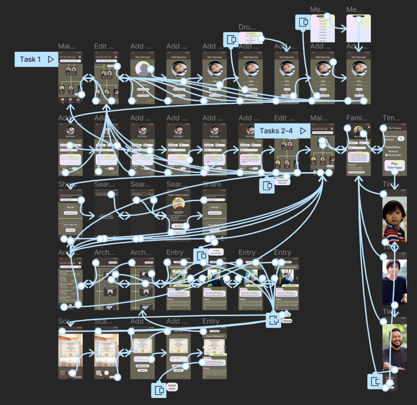
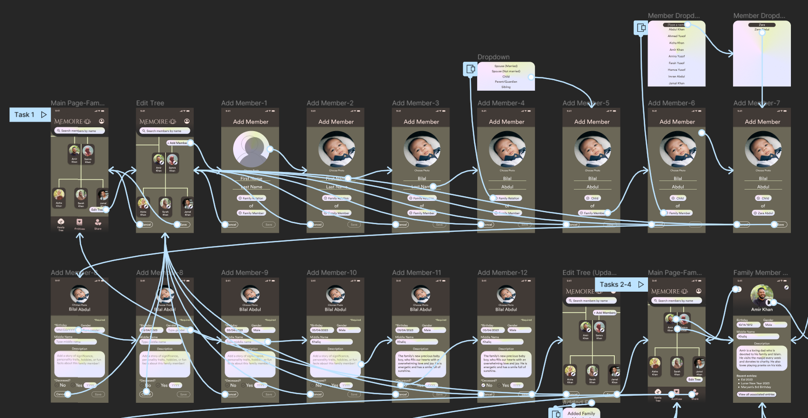
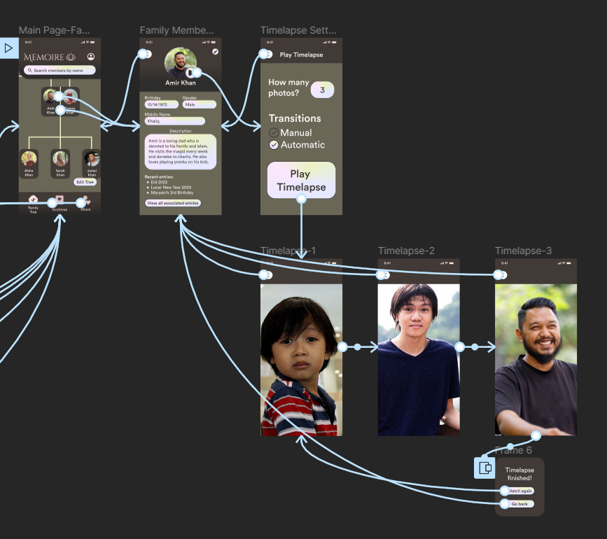
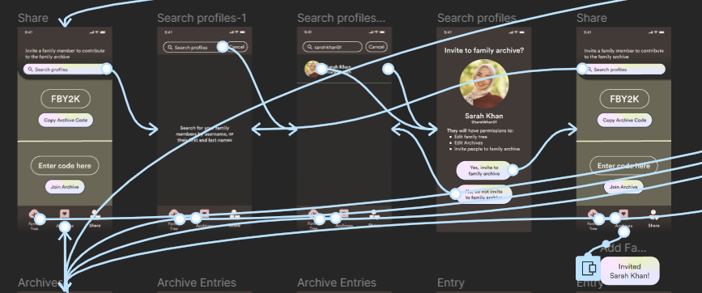
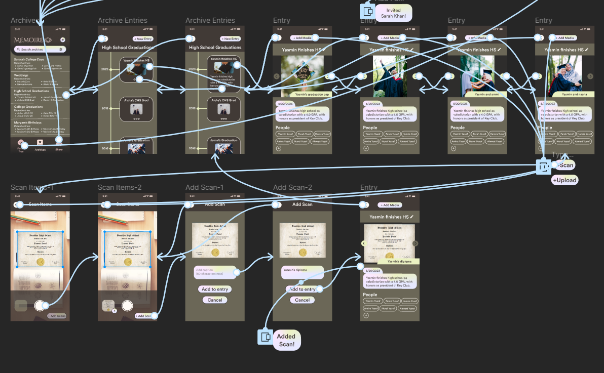
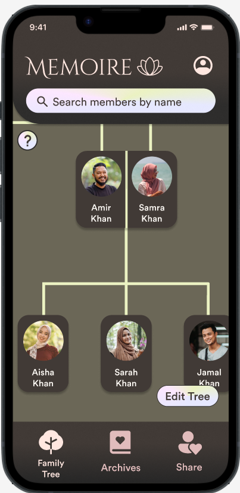
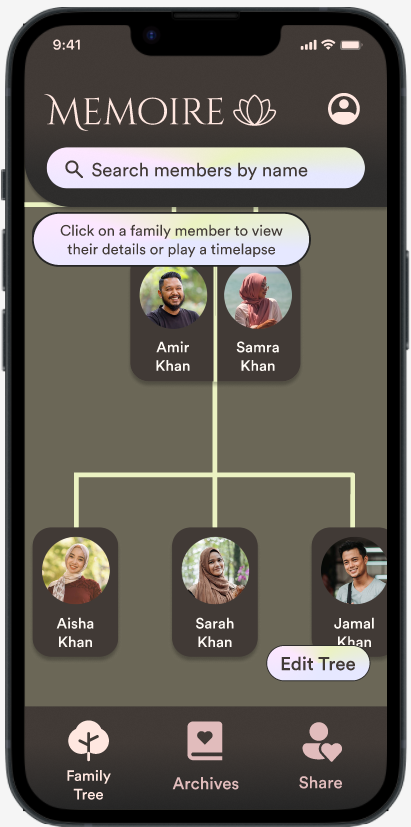

# DH110 Assignment 7: High Fidelity Prototype
# Maleeha Zaman

## Overview
My project is a family archival app called "Memoire" where users can can craft and experience their own family archive in a creative and simple way, collaborate with other family members, explore their family lineage, and have unlimited space to store important media (photos, audio recordings, documents, videos, journal entries). 

**Purpose of Interactive Prototype**: The following interactive prototype is designed to solve and illustrate four features for family archival, family sharing, and media uploading/scanning. The purpose of creating this high-fidelity prototype is to visualize important functions and make improvements to user interactions and design. Furthermore, by having users test an interactive prototype via cognitive walkthrough, issues in UI/UX can be identified and we can visually see how user's interact with the product.  

## Tasks 
### Task 1: Add a new member to the family tree
> **Scenario**: Imagine your aunt, Zara Abdul, recently gave birth to a newborn baby boy so you want to add him to the family tree. Add Zara's newborn son Bilal Abdul to the family tree.
  
> _User will click edit tree, then click on edit members. The user must input the new member's first and last name, and their position on the family tree (select a member and select their relation to that member). The user also has the option to upload a profile photo, but this is not required when adding a member. Then the user must input the member's birthday, and whether they are deceased. The user also has the option to input the member's gender, middle name, and a short description of them. The user then clicks save and is notified they added a member. They must click save again to exit the family tree editing mode._

### Task 2: Play a timelapse of a family member
> **Scenario**: Imagine your dad, Amir Khan, wants to share how he looked when he was younger with you and how he has changed over the years. Your dad already has photos of his younger self in the archive, so you're curious as to whether you can play a timelapse of him over the years. Play a timelapse of Amir Khan.

> _The user clicks on Amir Khan's profile and is navigated to a page with details about the family member. At the corner of their profile picture is a play button, which they click and are navigated to the page about the timelapse. They select settings (how many pictures to show and whether transitions are manual or automatic) for the timelapse and click the play timelapse button._  

### Task 3: Invite a family member, who also has an account, to edit and view the family archive
> **Scenario**: Imagine you want to invite your sister who also has a Memoire account to edit and view the family archive. Your sister, Sarah Khan, has lots of pictures from her birthday that you want her to add. Invite Sarah Khan to edit and view the family archive.
 
> _The user clicks on the share button on the bottom navigation bar. Then they click on search profiles and type in Sarah Khan's username "sarahkhan01", and her profile pops up. The user would click on her profile and be prompted as to whether they want to invite the profile. The user would select yes and be notified that the profile was invited._

### Task 4: Scan a document and add it to an archive entry
> **Scenario**: You visit your cousin, Yasmin Yusof, who just graduated high school. She shows you her high school diploma and you recall Yasmin forgot to add the diploma to the archive. You decide to scan her diploma and add it to her entry for her high school graduation. Find the entry for Yasmin's high school graduation, then scan and add her diploma to it.

> _The user clicks on archives on the navigation bar. They will look through the archives and find and click one called "High School Graduations". They would click on the entry box labelled "Yasmin finishes HS", which will navigate the user to a full page with the entire gallery within the entry. They will then click on add media where they will be prompted with pop-up asking them whether to scan or upload. They would click on scan and be directed to a camera with edge-detecting software where they will be able to scan the diploma. They will then click on add scans which is in the bottom right corner, where they will be prompted as to whether they want to add a caption. The user may add a caption if they choose, then click add to entry where the system will notfy them that the scan was added to the entry's gallery._

## Wireflow with Interface Design

### Task 1 Wireflow

### Task 2 Wireflow

### Task 3 Wireflow

### Task 4 Wireflow

## Interactive Prototype
* Interactive prototype for [Task 1](https://www.figma.com/proto/qyKS75FVXucBd1Eip6xdSW/High-Fidelity-Prototype?page-id=0%3A1&type=design&node-id=1-3&viewport=659%2C-402%2C0.13&scaling=scale-down&starting-point-node-id=1%3A3&show-proto-sidebar=1)
* Interactive prototype for [Task 2-4](https://www.figma.com/proto/qyKS75FVXucBd1Eip6xdSW/High-Fidelity-Prototype?page-id=0%3A1&type=design&node-id=88-1471&viewport=659%2C-402%2C0.13&scaling=scale-down&starting-point-node-id=88%3A1471&show-proto-sidebar=1)

## Cognitive Walkthrough
For first impressions, my classmates liked the design a lot. They mentioned they like the colors and the layout, and how the font was very readable. They all thought the app's goal was to primarily keep track of your own family tree. During the in-class walkthrough, I had them add a family member, invite a family member to view and edit the archive, and play a timelapse.
They all found the tasks to be very intuitive, especially adding a member and sharing the family tree. One classmate noted that the timelapse feature was difficult to navigate at first because it felt more hidden. They were unsure whether to look for the timelapse in the archives or in the family tree. Overall, they describe the app was very detailed and easy to use, the app felt pretty self-explanatory and they had little to no confusion when navigating it. 

## Iterations
I mainly added more back and forward flows, and made the prototype much more user friendly by merging all the flows (task 1 flow and task 2-4 flows) into one so users can complete all the tasks starting from the same flow. I did this because my classmates were confused as to which flow to start from and wanted to explore the app all at once. Now the app should feel more explorable and easy to navigate with all the flows connected to each other and not separated like task like before.  
One user was concerned with the hidden nature of the timelapse task. In response to that, I added a bit of help documentation to the family tree page where users can click on the question mark and are told more about the actions they can perform on the family tree. Hopefully this would encourage users to explore the timelapse function as the help documentation encourages them to open a family member's details to play a timelapse.  
   
I also changed the member profile details page a bit as well to improve the design. I changed the back arrow button to an x-button, and added a slide in and out transition to make the switch between screens feel more intuitive. I also changed the play button to something without round edges to look more refined.  
  
## Reflection
