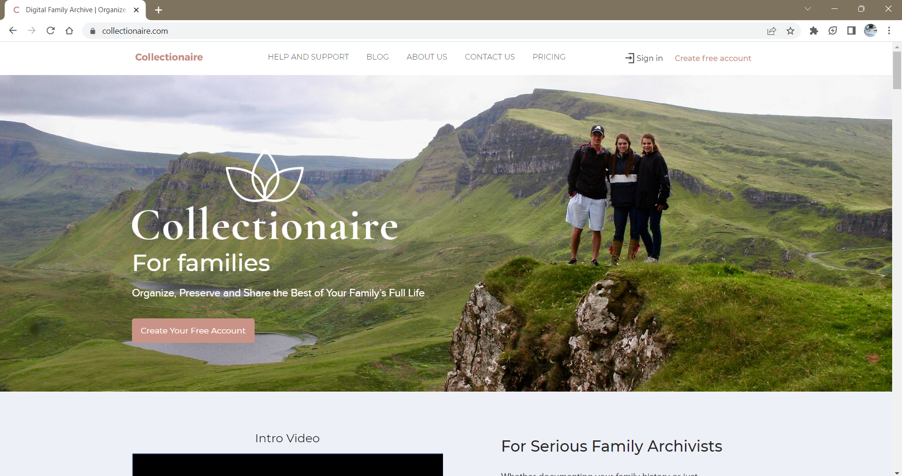
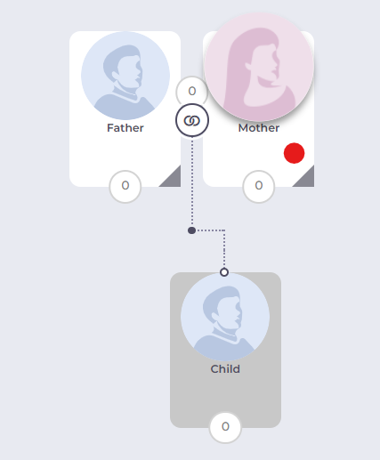
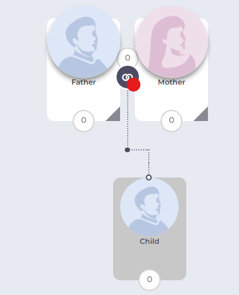
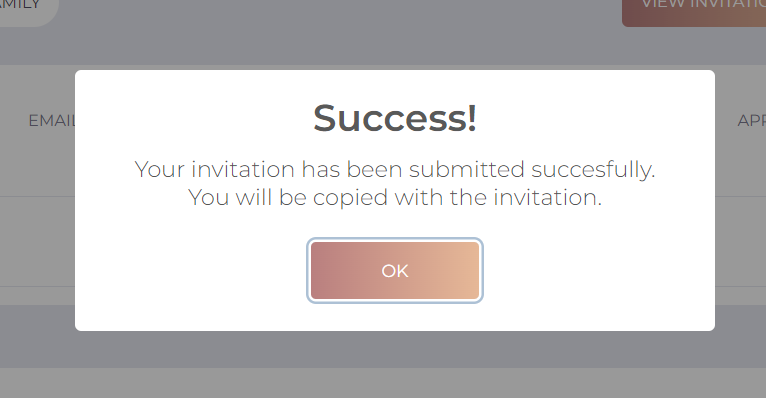
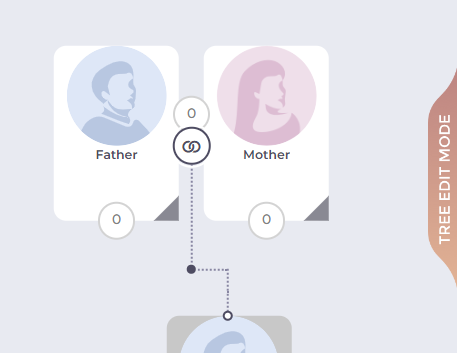
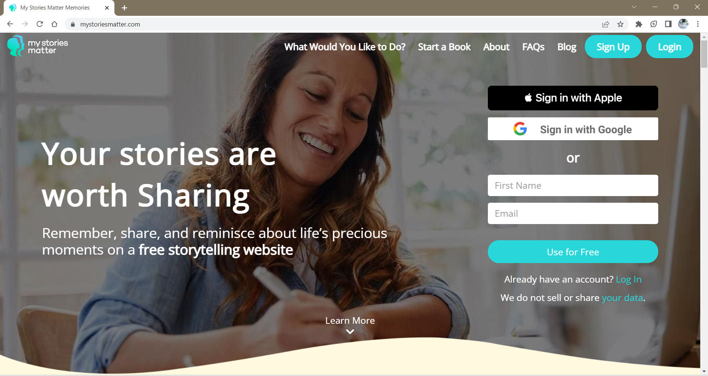

# Assignment 01: Heuristic Evaluation - Maleeha Zaman, DH110
## Tentative Title: Family Memory Archival 
>When my parents immigrated to America from Pakistan, they were only able to bring a few pictures with them and had to leave most of them at home. I've always wanted to see lots of pictures of my mom because she would always talk about how she was very popular with guys when she was young and her crazy adventures during her college days. When we did travel back to Pakistan to visit my grandparents, however, we found most of the photos had been lost during the moving process or misplaced. Losing these pictures felt like years worth of precious memories had been lost and it was sad they weren't able to share these memories with me. In this age, memory archival has become vastly digitized, such that most of the photos we take are stored in our phones. However, this does not account for the past of our parents and grandparents, where most of their photos are physical due to film photography being the primary means of recording memories of their younger days. I plan to contribute through this UX project in order to preserve precious family memories to be shared across future generations and viewed at the user's convenience.

## Competitor A: Collectionaire

View the full site here: [Collectionaire](https://collectionaire.com/)
>Collectionaire is a website with a mission to document family history and archive immediate family's memories. To do this, users can make an account, go to their "Create a new collection", and select a type of collection to make (Family Tree or Organization structure). From there, users can build a family tree or import a FamilySearch or GEDCOM file as a tree. The website has extensive information on what Connectionaire is, services that they provide, and video tutorials. 
#### Heuristic Evaluation
_Overall Evaluation_:
 
 
### 1. Visibility of system status
>The website clearly informs the user about its current status. 

**Good**: The site lets the user know the members being affected when they edit information on the tree by enlarging the icon of the family member. 
   
**Good**: The site clearly lets the user know if an invitation to view their collection has been sent by darkening the rest of the screen and showing a pop-up saying “Success!”. 
  
**Bad**: The site lets the user know when they are in tree editing mode by having a tab on the side appear that says “Tree Edit Mode”, however the site does not indicate when the user is in collection viewing mode. This is inconsistent and can confuse the user as to which mode of editing they are in. 
  
_Severity Rating: 2_ 
_Recommendation: Add a tab when the user is in collection viewing mode that says “Collection Viewing Mode”._  

### 2. Match between system and the real world
>The website uses language that is familiar to the user and presents information in a way that is analogous to the real world 
**Good**: The site uses terms like "My Dashboard", "My Training", "My Tasks", "My Stories" 
**Bad**: The page for writing stories is called the "Creativity Center" which may not be intuitive to all users.                                                                                                          
### 3. User control and freedom
>The website gives users a way to easily undo an unwanted action                                                                              
                                                                                               
### 4. Consistency and standards
>The website follows conventions followed by similar websites 

### 5. Error prevention
>The website prevents errors by reducing error-prone conditions or checking for them and notifying the user 
                                                                              
### 6. Recognition rather than recall
>The website makes information needed to navigate the website visible or easily accessible 
                                           
### 7. Flexibility and efficiency of use
>The website allows processes to be tailored to all users from novice to expert                                                                                                                                                                        
### 8. Aesthetic and minimalist design
>The website only contains information that is relevant and is designed to highlight the essentials   
                                
### 9. Help users recognize, diagnose, and recover from errors
>The website provides clear error messages that state the problem and potential solutions 

### 10. Help and documentation
>The website has resources to help users understand how to complete tasks 

## Competitor B: My Stories Matter

View the full site here: [My Stories Matter](https://www.mystoriesmatter.com/)
#### Background Information
~ IN PROGRESS ~
My Stories Matter is an organization with a mission to help seniors to write creative stories. To do this, users can make an account, go to their "Creativity Center", and select a prompt to follow. From there, users can type their story in a text box or upload a photo of a written response. The website also has extensive information on what TimeSlips is, services that they provide, resources, news, and ways to get involved with the organization.
#### Heuristic Evaluation
