# Assignment 01: Heuristic Evaluation - Maleeha Zaman, DH110
## Tentative Title: Family Memory Archival 
>When my parents immigrated to America from Pakistan, they were only able to bring a few pictures with them. Whenever we did travel back to Pakistan to visit my grandparents, we found most of the photos had been lost during the moving process or misplaced. Years worth of nostalgic stories my parents told me about their younger days had been lost and it was sad they weren't able to share these memories with me. Although memories today have become digitized and encapsulated in our phone camera rolls, there is still a struggle to fully preserve those old photos our parents took on film all in one place. I plan to contribute through this UX project in order to preserve precious family memories to be shared across future generations and viewed at the user's convenience, strengthening the connection between us and our loved ones. 

## Competitor A: Collectionaire

View the full site here: [Collectionaire](https://collectionaire.com/)
>Collectionaire is a website with a mission to document family history and archive immediate family's memories. To do this, users can make an account, go to "Create a new collection", and select a type of collection to make (Family Tree or Organization structure). From there, users can build a family tree or GEDCOM (genealogical data) file as a tree. The website has extensive information on what Connectionaire is, services that they provide, and video tutorials. 
#### Heuristic Evaluation
_Overall Evaluation_:
 
 
### 1. Visibility of system status
The website clearly informs the user about its current status. 

>**GOOD**
>+ The site lets the user know the members being affected when they edit information on the tree by enlarging the icon of the family member. 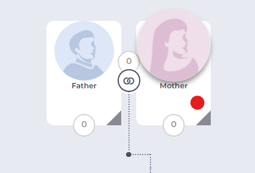 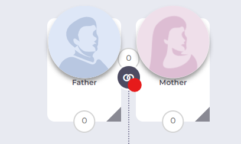
>+ The site clearly lets the user know if an invitation to view their collection has been sent by darkening the rest of the screen and showing a pop-up saying “Success!”.   
-----------------------------------------------------------------------------------------------------------------------------------------------------------------------
>**BAD**
>+ The site lets the user know when they are in tree editing mode by having a tab on the side appear that says “Tree Edit Mode”, however the site does not indicate when the user is in collection viewing mode. This is inconsistent and can confuse the user as to which mode of editing they are in.   _Severity Rating: 2_ _Recommendation: Add a tab when the user is in collection viewing mode that says “Collection Viewing Mode”._  

### 2. Match between system and the real world
The website uses language that is familiar to the user and presents information in a way that is analogous to the real world 

>**GOOD**
>+ The site utilizes a search bar for linked albums and a search bar for people when viewing collections. The placeholder of the text in the search bars are very specific and understandable. The album search bar says "Keyword, name, etc.;search all Linked Albums" and the people search bar says "Enter a few characters of a name". Having specific text placeholders within the search bar that prompt the user what to type into it is very helpful for the user's habits and denotes the relevant information they can search to find a person or album. 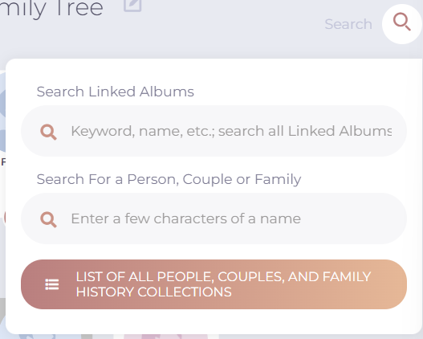 
-----------------------------------------------------------------------------------------------------------------------------------------------------------------------
>**BAD**
>+ The navigation menu uses terms that could be misguiding users to get to where they want to be, particularly "View Collections" and "Guest Permissions".   _Severity Rating: 1_ _Recommendation: Consider modifying navigation text to something more helpful towards users' existing habits. Perhaps changing "View Collections" to "My Collections" and "Guest Permissions" to "Share Collections"._        
                                                                                         
### 3. User control and freedom
The website gives users a way to easily undo an unwanted action 

>**GOOD**
>+ The site has a save or cancel option when editing any text, such as names, titles, or descriptions. This is helpful for the user who might not want to save the changes they made and allow them to keep the previous version of the text. 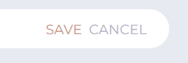 
-----------------------------------------------------------------------------------------------------------------------------------------------------------------------
>**BAD**
>+ The only way to undo an action while editing the collection is through the undo button, the user can't use "ctrl+z" keys. Furthermore, the user can't redo their work, they can only undo it. 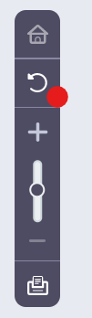 _Severity Rating: 2_ _Recommendation: Add a forward arrow to the side bar that users can click on to redo their work. Add functionality for users to use "ctrl+z" keys for undo and "ctrl+y" keys for redo._   
                                                                                               
### 4. Consistency and standards
The website follows conventions followed by similar websites. 

>**GOOD**
>+ Clicking on "Collectionaire" on the top left corner of the page takes the user back to the homepage.
>+ The options of the navigation bar is listed at the top of the screen. These options collapse into a hamburger menu when the window width is narrow.    
-----------------------------------------------------------------------------------------------------------------------------------------------------------------------
>**BAD**
>+ The term "Exit" when hovering over the user's account is unconventional and difficult to understand. 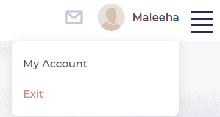 _Severity Rating: 2_ _Recommendation: Change the term "Exit" to "log Out" which follows standard account conventions._   

### 5. Error prevention
The website prevents errors by reducing error-prone conditions or checking for them and notifying the user. 

>**GOOD**
>+ The site autosaves the collection when navigating to a new page, and it doesn't allow the user to navigate to a new page before deciding to save or cancel the work the user has done.  
-----------------------------------------------------------------------------------------------------------------------------------------------------------------------
>**BAD**
>+ The text input box for descriptions of albums, people, or events does not have spelling or grammar check options. 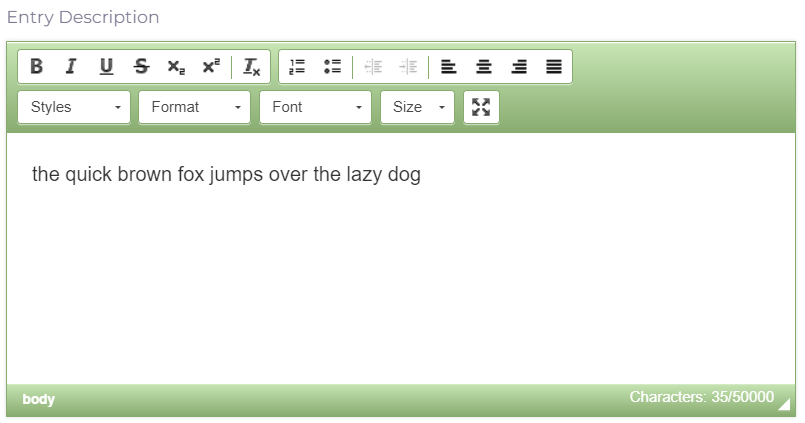 _Severity Rating: 3_ _Recommendation: Add spell check to the text input boxes to prevent grammar errors._   
                                                                              
### 6. Recognition rather than recall
The website makes information needed to navigate the website visible or easily accessible. 

>**BAD**
>+ The editing modes for a collection are inconsistent with each other. The tree editing mode has a button to navigate to the other mode that says “Exit Tree Editing Mode”, however the collection viewing mode has no button to navigate to tree editing mode. The user has to click on the three dots and “Edit Tree” to switch to tree editing mode.  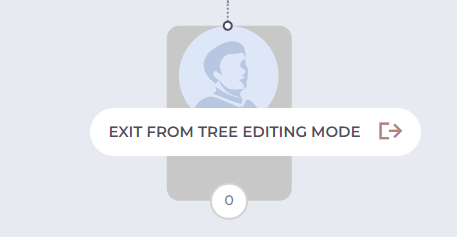 _Severity Rating: 3_ _Recommendation: When the user is in tree editing mode, instead of having a button that says “Exit Tree Edit Mode”, have a button that says “Switch to Collection Viewing Mode”. Apply this vice versa for collection viewing mode with a button that says “Switch to Tree Edit Mode”._ 
>+ The "Guest Permissions" option on the navigation bar has sub-menu options within it that specify an action related to invites and requests. Some options sound too redundant and unneccesary which can be confusing for the user. 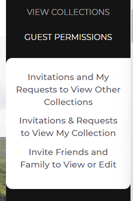 _Severity Rating: 3_ _Recommendation: Consolidate the sub-menu options to reduce cognitive load on users. Perhaps condense "Invite Friends and Family to View or Edit" and "Invitations & Requests to View My Collection" to one sub-menu option "Invitations & Requests to Access My Collections"._ 
                                           
### 7. Flexibility and efficiency of use
The website allows processes to be tailored to all users from novice to expert. 

>**GOOD**
>+ The collection editing page for each family member gives users different options to add descriptions of the family member, linked albums, and a timeline. Such editing features include adding photos or text. 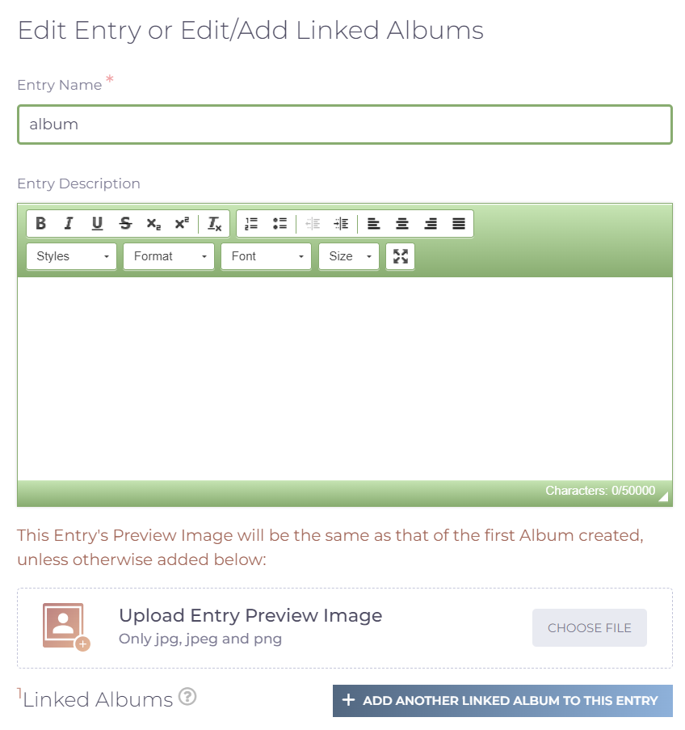  
-----------------------------------------------------------------------------------------------------------------------------------------------------------------------
>**BAD**
>+ There is no option to audio record a memory or any speech to text option, which makes it less efficient to use for people who may not be as good with typing and who would like to speak about the memories being added to the collection. _Severity Rating: 3_ _Recommendation: Add a speech to text and audio recording feature._  
>+ Having two editing modes, tree editing mode and collection viewing mode, can be inefficient and frustrating for the user to constantly switch between the two to perform one action. _Severity Rating: 3_ _Recommendation: Consolidate editing modes into one single editing mode where the user is able to access both actions related to editing the tree or collections. This will make the editing process much quicker and more efficient for users._    
                                                                
### 8. Aesthetic and minimalist design
The website only contains information that is relevant and is designed to highlight the essentials   
 
>**GOOD**
>+ The user can expand and collapse albums when viewing collections. 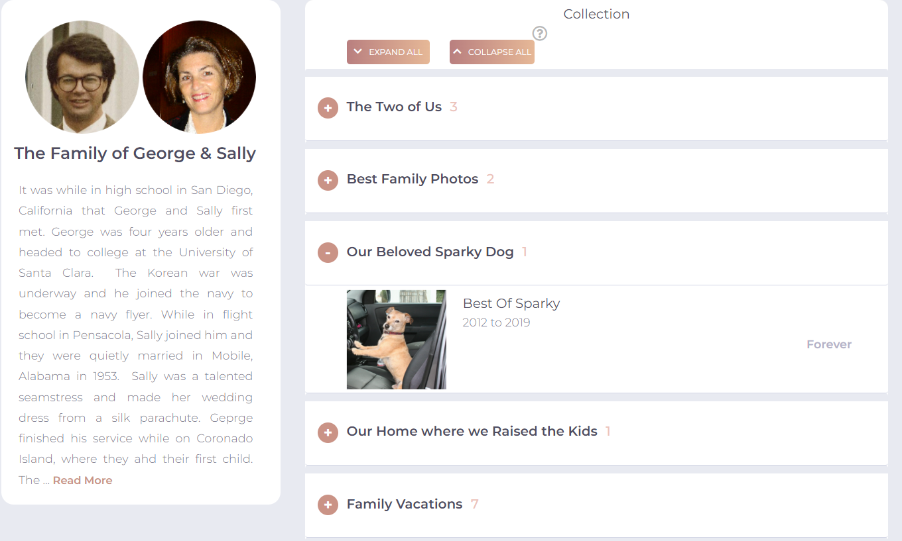  
>+ The editing page for a family member is very minimalistic and easy to navigate for the user. The page utilizes plus icons and simple vocabulary so the user can instantly find what part of the member profile they want to edit. 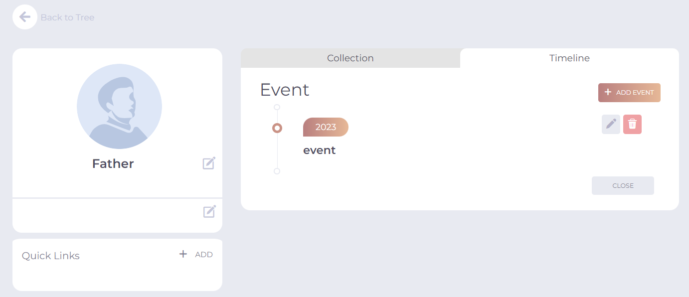  
-----------------------------------------------------------------------------------------------------------------------------------------------------------------------
>**BAD**
>+ The user has to scroll through a long introduction page on the landing page to get to the footer menu, which has options that can't be accessed at the navigation bar on the top of the page. This wordy and long introduction page can be frustrating for the user to find the "Contact Us" or "Privacy and Security" pages. _Severity Rating: 3_ _Recommendation: Reduce the information on the introduction page to a simple blurb about the mission of the website and move any other information to the blog or FAQ page. This way it will make the landing page design less overwhelming and more minimalistic. The user would also be able to scroll down to the footer menu much faster._  

### 9. Help users recognize, diagnose, and recover from errors
The website provides clear error messages that state the problem and potential solutions 

>**GOOD**
>+ When the user enters an invalid email address on the login page, they are redirected to creating a free account with the invalid email already inputted onto the form already. 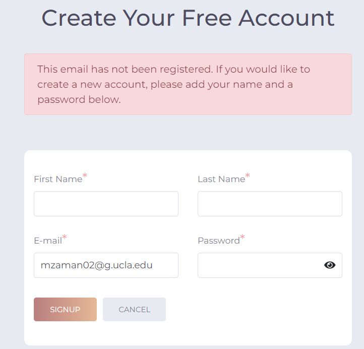  
-----------------------------------------------------------------------------------------------------------------------------------------------------------------------
>**BAD**
>+ When the user edits a family member, they can save the profile even without filling out the required fields marked with a red astrix. 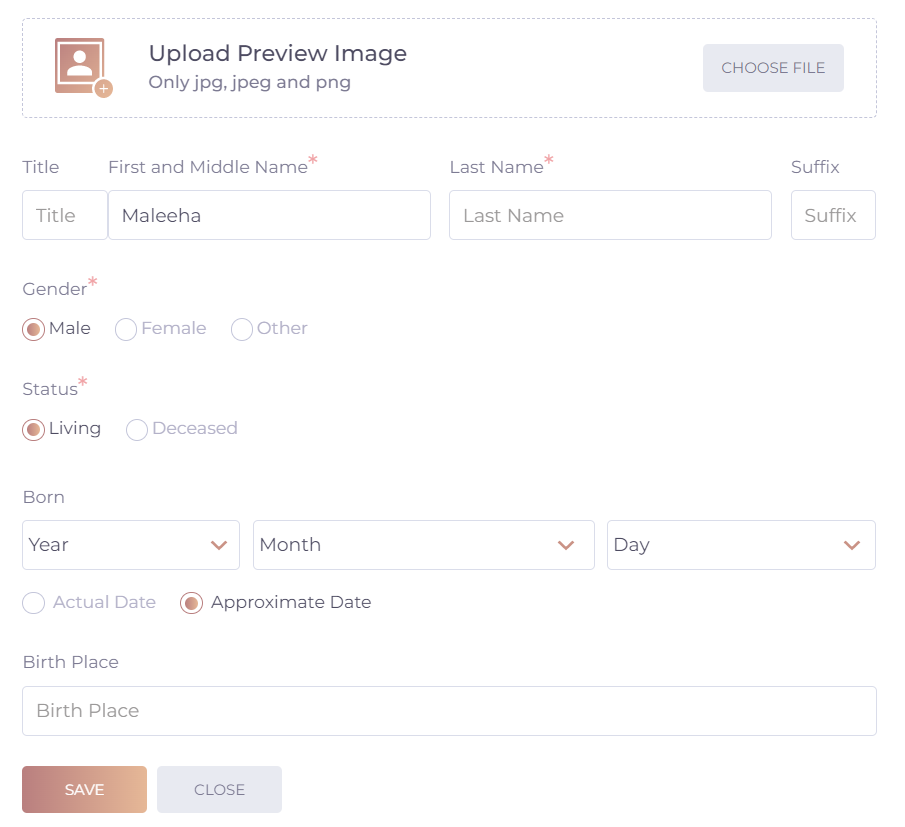  _Severity Rating: 2_ _Recommendation: Prompt the user before saving as to whether they would like to leave these fields blank, so that the user is informed that key information is missing from the profile before they continue making their tree. Having something on their profile indicate this missing information on the tree-view would also help users easily identify which members are still missing key information._  

### 10. Help and documentation
The website has resources to help users understand how to complete tasks 

>**GOOD**
>+ The website includes "Navigation Rules and Tips" tab in the collections editor that gives the user a concise list of tips of the functionalities of buttons in the collection view. 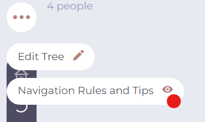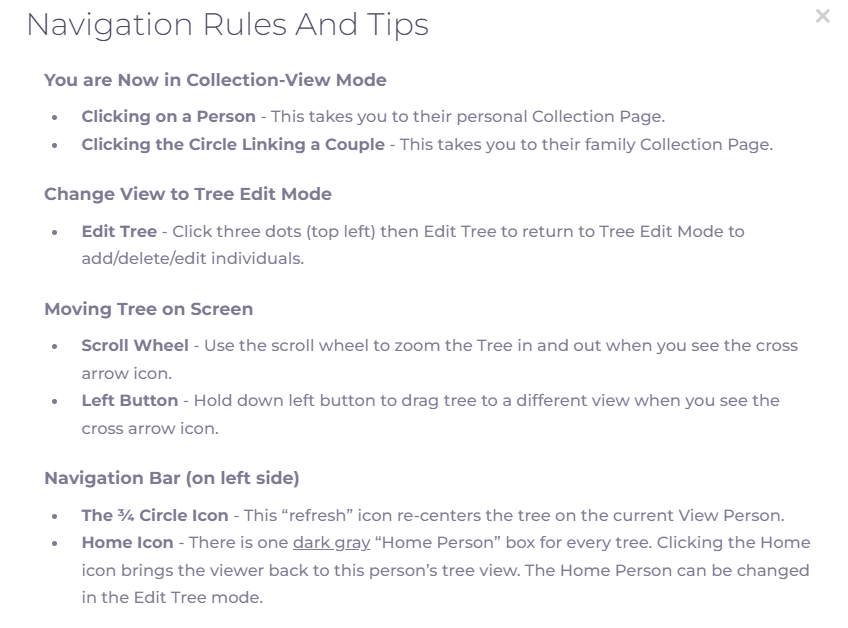  
>+ The website has a "Help and Support" page that can be accessed through the navigation menu at the top. It has a lot of frequently asked questions, a link to view help videos, and a search bar to find a certain topic. 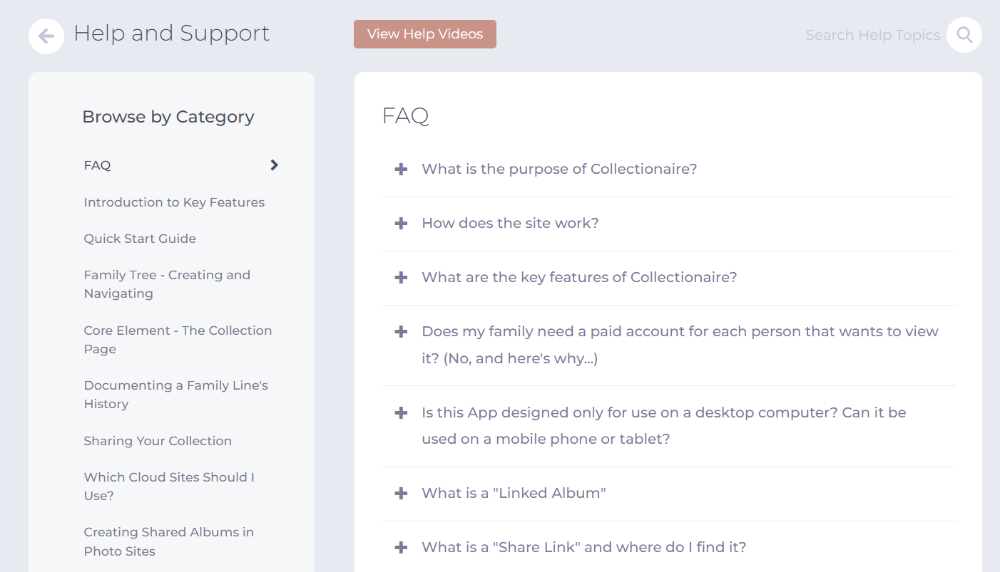  
-----------------------------------------------------------------------------------------------------------------------------------------------------------------------
>**BAD**
>+ The "Help Videos" page does not have a video or videos dedicated to sharing collections and requesting to view a collection, which is inefficient for users who might not understand the written explanation and need a visual to understand how to share.  _Severity Rating: 2_ _Recommendation: Add a video or videos to the "Help Videos" page dedicated to tutorials on sharing and requesting to view collections._  

## Competitor B: My Stories Matter

View the full site here: [My Stories Matter](https://www.mystoriesmatter.com/)
>My Stories Matter is an organization with a mission to help seniors to write creative stories. To do this, users can make an account, go to their "Creativity Center", and select a prompt to follow. From there, users can type their story in a text box or upload a photo of a written response. The website also has extensive information on what TimeSlips is, services that they provide, resources, news, and ways to get involved with the organization.
#### Heuristic Evaluation
